# 3. Requisitos do Sistema

Este capítulo descreve os requisitos do sistema. Os requisitos foram levantados em reunião gravada com o cliente (Jotanunes), registrados na especificação do projeto no Spec Kit e validados pelo dono do produto nas sessões de esclarecimento.

## 3.1. Requisitos Funcionais

Os requisitos funcionais descrevem as funcionalidades que são disponibilizadas pelo sistema aos seus usuários. Eles estão agrupados em acesso à área Jotanunes, usuários internos, cadastros, convite, análise, acompanhamento, portal da terceirizada e funções transversais.

RF01 — Entrar na área Jotanunes pelo Fluig

O sistema deverá permitir que o usuário aberto a partir do Fluig entre na área Jotanunes sem nova tela de login, a partir do token de identidade assinado entregue pelo Fluig (login, nome, e-mail e, opcionalmente, o papel de administrador), recusando token ausente, expirado, adulterado ou emitido para o portal.

RF02 — Entrar na área Jotanunes com login próprio

O sistema deverá permitir que o usuário interno entre na área Jotanunes com login e senha. Login inexistente e senha errada deverão receber a mesma mensagem ("Login ou senha incorretos."), e usuário desativado ou senha provisória vencida deverão ser recusados com mensagem própria.

RF03 — Criar nova senha no primeiro acesso do usuário interno

O sistema deverá exigir que o usuário interno que entrou com senha provisória crie uma nova senha antes de acessar qualquer outra tela ou dado, informando a senha atual, a nova senha e a confirmação.

RF04 — Trocar senha e sair da sessão de login próprio

O sistema deverá oferecer, somente na sessão de login próprio, as opções "Trocar senha" (informando a senha atual e a nova) e "Sair", que encerra a sessão na hora. Na sessão aberta pelo Fluig essas opções não aparecem.

RF05 — Desligar o login próprio por configuração

O sistema deverá permitir desligar o login próprio por configuração do servidor. Desligado, a área Jotanunes aberta sem token deverá mostrar a mensagem "Abra este sistema pelo Fluig." e a API deverá recusar login, troca de senha e sessões de login próprio.

RF06 — Informar o usuário, o perfil e a origem da sessão

O sistema deverá informar à área Jotanunes o nome do usuário, se é administrador, a origem da sessão (Fluig ou login próprio) e se há troca de senha pendente, para montar o menu e as ações de cada tela.

RF07 — Listar usuários internos

O sistema deverá permitir que o administrador liste os usuários internos com nome, login, e-mail, perfil, situação em texto (Aguardando primeiro acesso, Senha provisória expirada, Ativo, Desativado) e último acesso, com busca por nome, login ou e-mail e filtros por situação e perfil.

RF08 — Cadastrar usuário interno

O sistema deverá permitir que o administrador cadastre um usuário interno informando nome, e-mail, login e se é administrador. O sistema deverá gerar a senha provisória e enviá-la por e-mail ao usuário, sem exibi-la na tela; se o e-mail falhar, nada deverá ser criado.

RF09 — Editar usuário interno e alterar o perfil

O sistema deverá permitir que o administrador altere nome, e-mail e o papel de administrador de um usuário interno. O login não poderá ser alterado. Dar ou tirar o papel de administrador deverá derrubar as sessões abertas do usuário.

RF10 — Desativar e reativar usuário interno

O sistema deverá permitir que o administrador desative e reative usuários internos, recusando desativar o último administrador ativo e desativar a si mesmo. O usuário desativado deverá perder o acesso na próxima ação.

RF11 — Redefinir senha de usuário interno

O sistema deverá permitir que o administrador redefina a senha de um usuário interno, gerando nova senha provisória enviada por e-mail, invalidando a senha anterior e as sessões abertas e zerando o bloqueio por tentativas.

RF12 — Criar o primeiro administrador na instalação

O sistema deverá oferecer um comando de servidor que cria o primeiro administrador interno a partir de login, nome e e-mail, envia o e-mail de acesso e mostra a senha provisória apenas no terminal, recusando a execução se já houver administrador ativo, salvo com a opção de forçar (recuperação).

RF13 — Listar obras

O sistema deverá permitir que os usuários da Jotanunes listem as obras com nome, código, local, quantidade de empresas e situação, com busca por nome, código ou cidade e filtro por situação (ativas, inativas, todas).

RF14 — Cadastrar e editar obra

O sistema deverá permitir que o administrador cadastre e edite obras informando nome, cidade, UF e código interno opcional.

RF15 — Ativar e desativar obra

O sistema deverá permitir que o administrador desative e reative obras, mantendo os vínculos e o histórico da obra desativada.

RF16 — Vincular e desvincular empresas da obra

O sistema deverá permitir que o administrador busque empresas por razão social, nome fantasia ou CNPJ e as vincule a uma obra, sem duplicar vínculos, e que desvincule empresas, com confirmação.

RF17 — Consultar o detalhe da obra

O sistema deverá exibir os dados da obra e a lista "Empresas da obra", com a situação de acesso ao portal, a contagem de documentos por situação e a data do vínculo de cada empresa.

RF18 — Listar empresas

O sistema deverá permitir que os usuários da Jotanunes listem as empresas com razão social, CNPJ, situação de acesso ao portal e andamento dos documentos, com busca por nome ou CNPJ e filtros por obra, situação de acesso e "com pendência".

RF19 — Cadastrar e editar empresa

O sistema deverá permitir que o administrador cadastre e edite empresas informando razão social, nome fantasia opcional, CNPJ, e-mail de contato, nome do contato e telefone opcionais. O CNPJ não poderá ser alterado depois do primeiro convite.

RF20 — Validar o CNPJ

O sistema deverá validar o CNPJ pelos dígitos verificadores, aceitando os formatos numérico e alfanumérico, com ou sem máscara, armazená-lo sem máscara e recusar CNPJ já cadastrado.

RF21 — Ativar e desativar empresa

O sistema deverá permitir que o administrador desative e reative empresas. A empresa desativada deverá perder o acesso ao portal na hora e deixar de ter documentos exigidos, mantendo o histórico.

RF22 — Cadastrar, editar e listar tipos de documento

O sistema deverá permitir que o administrador cadastre e edite tipos de documento com nome único (3 a 120 caracteres) e instruções para a empresa (até 1.000 caracteres), e que todos os usuários da Jotanunes listem os tipos com filtro por situação.

RF23 — Ativar e desativar tipo de documento

O sistema deverá permitir que o administrador desative e reative tipos de documento. O tipo desativado deixa de ser exigido das empresas, e os envios já feitos continuam no histórico.

RF24 — Criar o catálogo padrão de tipos de documento

O sistema deverá criar automaticamente, ao iniciar com o catálogo vazio, os 10 tipos de documento padrão com instruções, sem duplicar em reinícios e sem alterar nada quando já houver qualquer tipo cadastrado.

RF25 — Enviar convite à empresa

O sistema deverá permitir que qualquer usuário da Jotanunes envie o convite a partir do cadastro da empresa ativa. O e-mail deverá conter o nome da empresa, as obras vinculadas, o link do portal, a senha provisória e as instruções de primeiro acesso.

RF26 — Reenviar convite

O sistema deverá permitir reenviar o convite, com confirmação, invalidando o link e a senha anteriores e redefinindo o acesso da empresa.

RF27 — Acompanhar a situação de acesso e os convites

O sistema deverá exibir, no detalhe da empresa, a situação de acesso ao portal (Não convidada, Convidada, Convite expirado, Ativa ou Desativada), o último convite (data, destinatário, validade ou data do primeiro acesso), o último acesso e o histórico de convites.

RF28 — Consultar a fila de análise

O sistema deverá exibir os envios "Em análise" do mais antigo para o mais novo, com empresa, documento, arquivo e data de envio, e filtros por obra, empresa e tipo de documento.

RF29 — Consultar envios analisados

O sistema deverá permitir filtrar a fila pela situação para consultar os envios aprovados ou rejeitados, do mais recente para o mais antigo.

RF30 — Abrir e baixar o arquivo do envio

O sistema deverá permitir que os usuários da Jotanunes abram ou baixem o arquivo de qualquer envio, somente com identidade válida, registrando o download na auditoria.

RF31 — Aprovar envio

O sistema deverá permitir que o administrador aprove um envio "Em análise", com confirmação, registrando quem aprovou e quando.

RF32 — Rejeitar envio com motivo

O sistema deverá permitir que o administrador rejeite um envio "Em análise" informando motivo de 5 a 500 caracteres, registrando quem rejeitou, quando e o motivo, e enviando e-mail à empresa com o documento, o motivo e o link do portal.

RF33 — Consultar documentos e histórico da empresa

O sistema deverá exibir, no detalhe da empresa, a situação de cada documento exigido, o envio atual, a análise e o histórico completo de envios de cada tipo, inclusive dos tipos desativados.

RF34 — Exibir o painel de indicadores

O sistema deverá exibir o painel com a quantidade de documentos aguardando análise, de empresas com documento pendente ou rejeitado, de empresas convidadas que ainda não acessaram o portal, de empresas ativas e de obras ativas, com atalhos para as listas correspondentes.

RF35 — Acessar o portal com CNPJ e senha

O sistema deverá permitir que a empresa entre no portal com CNPJ e senha. Ao abrir o link do convite, o portal deverá conferir o convite e preencher o CNPJ; link inválido, usado ou substituído deverá mostrar "Este link não é mais válido.".

RF36 — Criar nova senha no primeiro acesso da empresa

O sistema deverá exigir que a empresa que entrou com a senha do convite crie uma nova senha antes de acessar qualquer outra função do portal.

RF37 — Listar os documentos exigidos

O sistema deverá exibir à empresa todos os documentos exigidos, cada um com nome, instruções e situação escrita, um resumo das quantidades por situação e, quando não houver pendência, a mensagem "Nenhum documento pendente. Tudo certo por aqui.".

RF38 — Enviar arquivo de documento

O sistema deverá permitir que a empresa escolha, confira e envie um arquivo PDF, JPEG ou PNG de até 10 MB para documento "Pendente de envio", passando a situação a "Em análise".

RF39 — Reenviar documento rejeitado

O sistema deverá exibir o motivo da rejeição e permitir que a empresa envie um novo arquivo para o documento "Rejeitado", que volta a "Em análise".

RF40 — Consultar o histórico do documento e baixar os próprios arquivos

O sistema deverá exibir à empresa o histórico de envios de cada documento, do mais recente para o mais antigo, com situação, datas, tamanho e motivo das rejeições, e permitir baixar os próprios arquivos.

RF41 — Sair do portal

O sistema deverá exibir no cabeçalho do portal o nome da empresa conectada e a opção "Sair", que encerra a sessão.

RF42 — Registrar auditoria

O sistema deverá registrar em auditoria logins, bloqueios, trocas de senha, saídas, convites, envios, downloads, decisões de análise, gestão de usuários internos e tentativas negadas por falta de permissão, com autor, data e hora, recurso, origem da identidade e indicação de administrador.

RF43 — Adaptar as telas ao perfil do usuário

O sistema deverá esconder do usuário comum as ações de administrador, exibir os formulários em modo leitura e mostrar em cada tela afetada o aviso "Só administradores podem cadastrar, alterar ou analisar. Se você precisa, fale com a TI.". A tela "Usuários" só aparece no menu do administrador.

RF44 — Informar erros de operação

O sistema deverá exibir mensagens claras quando uma operação falhar (dados inválidos, falta de permissão, falha no envio de e-mail, arquivo recusado, sessão expirada), indicando quando possível como corrigir, sem perder os dados exibidos na tela.

## 3.2. Requisitos Não-Funcionais

Os requisitos não funcionais definem atributos de qualidade, restrições técnicas e condições operacionais do Portal de Documentação de Terceirizadas Jotanunes. Eles complementam as regras de negócio e os requisitos funcionais, estabelecendo critérios relacionados a segurança, privacidade, desempenho, usabilidade, acessibilidade, compatibilidade, confiabilidade, manutenibilidade e implantação. A classificação segue as categorias de requisitos de produto, organizacionais e externos propostas por Sommerville (Engenharia de Software), e a coluna "Como é atendido" indica o mecanismo adotado na solução.

| Código | Categoria | Requisito | Como é atendido |
|---|---|---|---|
| RNF01 | Segurança | Senhas nunca podem ser armazenadas nem exibidas em texto claro. | Senhas guardadas apenas como hash BCrypt com sal; nenhuma senha ou token é escrito em log ou na auditoria; a senha provisória só aparece no e-mail (e, no comando de instalação, no terminal). |
| RNF02 | Segurança | Toda requisição autenticada deve ter identidade válida e do tipo correto. | Tokens JWT assinados (HS256) com emissores e segredos distintos para Fluig, login próprio e portal; token ausente, expirado, adulterado ou de outra origem recebe 401. |
| RNF03 | Segurança | Resistência a tentativa e erro de senha e à descoberta de contas. | Bloqueio de 15 minutos após 5 falhas por CNPJ ou login, inclusive inexistente; mesmas mensagens para conta existente e inexistente; limite de 10 requisições por minuto por IP nas rotas anônimas. |
| RNF04 | Segurança | A permissão deve ser verificada no servidor. | Política de administrador aplicada às rotas de escrita da API, com resposta 403 `SEM_PERMISSAO` antes de qualquer validação ou efeito; teste automático percorre todas as rotas de escrita. |
| RNF05 | Segurança | Sessões com duração limitada e revogação imediata no login próprio. | Tokens com validade máxima de 8 horas; versão da credencial no token do usuário interno, que invalida as sessões ao desativar, redefinir ou trocar senha, mudar o papel ou sair. |
| RNF06 | Segurança | Comunicação protegida e cabeçalhos seguros. | HTTPS com certificado Let's Encrypt (Certbot) no nginx; cabeçalhos `X-Content-Type-Options`, `Referrer-Policy` e `X-Frame-Options` em todas as respostas da API; segredos apenas em variáveis de ambiente. |
| RNF07 | Privacidade/LGPD | Isolamento total entre empresas. | Toda consulta do portal é filtrada pela empresa do token; recursos de outra empresa respondem como "não encontrado"; testes de isolamento cobrem listar, ver, baixar e enviar. |
| RNF08 | Privacidade/LGPD | Arquivos nunca públicos. | Arquivos gravados fora da pasta pública, atrás de uma porta de armazenamento, e entregues apenas por rotas autenticadas; não há endereço permanente de arquivo. |
| RNF09 | Privacidade/LGPD | Rastreabilidade das ações sobre dados pessoais e documentos. | Trilha de auditoria com ator, origem da identidade, indicação de administrador, recurso, data e hora e IP, sem senhas, tokens ou conteúdo de arquivos. |
| RNF10 | Privacidade/LGPD | Minimização da exposição de dados de colaboradores. | O portal não mostra quem analisou os documentos; o e-mail de convite e o de rejeição trazem apenas o necessário ao processo. |
| RNF11 | Desempenho | As listas devem abrir em até 2 segundos no volume esperado. | Consultas paginadas e índices no PostgreSQL, dimensionados para 500 empresas, 50 obras, 30 tipos de documento e 20.000 envios. |
| RNF12 | Desempenho | O envio de um arquivo de 10 MB deve concluir em até 10 segundos numa conexão de 10 Mbps. | Upload direto em uma única requisição, com limite de tamanho aplicado no servidor e validação do conteúdo sem reprocessamento do arquivo. |
| RNF13 | Usabilidade | Interfaces simples, em português do Brasil, com tom de voz da Jotanunes. | Guia visual próprio (cores, tipografia Montserrat, forma-assinatura), mensagens diretas que dizem o que fazer, confirmação antes de ações com efeito relevante e estados de carregamento, vazio e erro em todas as listas. |
| RNF14 | Acessibilidade | Contraste WCAG AA e situação nunca indicada só por cor. | Paleta verificada para contraste AA; selos de situação sempre com texto; rótulos associados aos campos, link "Pular para o conteúdo", foco levado ao conteúdo ao trocar de página e textos para leitores de tela. |
| RNF15 | Compatibilidade | Funcionar nos navegadores atuais e em telas a partir de 360 px. | Aplicações web responsivas (React) voltadas às versões atuais de Chrome, Edge, Firefox e Safari; no celular, o menu da área Jotanunes vira botão "Menu" e o portal organiza os documentos em cartões. |
| RNF16 | Compatibilidade | A área Jotanunes deve funcionar dentro do Fluig. | Aplicação sem cabeçalho de marca própria, estilos isolados em um escopo próprio e roteamento por fragmento de endereço, sem depender de regras de reescrita no servidor do Fluig. |
| RNF17 | Confiabilidade | Operações concorrentes não podem gerar estado inconsistente. | Controle de concorrência na decisão de análise e no envio de documento (só a primeira operação vence); criação do catálogo padrão protegida contra inicializações simultâneas; regra do último administrador verificada em transação. |
| RNF18 | Confiabilidade | Falha no serviço de e-mail não pode deixar dados pela metade. | Convite, cadastro e redefinição de senha só são gravados se o e-mail for aceito pelo Resend; em caso de falha, o usuário vê a mensagem e nada muda. |
| RNF19 | Manutenibilidade | Código organizado e com baixo acoplamento a tecnologias externas. | Arquitetura hexagonal no backend (Domínio, Aplicação, Infraestrutura, API) com portas para e-mail, armazenamento de arquivos e relógio; contrato OpenAPI como fonte de verdade, com tipos das interfaces gerados a partir dele. |
| RNF20 | Manutenibilidade | Alterações devem ser protegidas por testes automatizados. | 467 testes no backend (xUnit, com PostgreSQL real via Testcontainers), 190 na área Jotanunes e 71 no portal (Vitest), além do roteiro E2E de 56 passos. |
| RNF21 | Portabilidade/Implantação | Implantação simples em servidor Linux, com configuração por ambiente. | API .NET 8 como serviço systemd atrás do nginx, PostgreSQL 16 local e interfaces como arquivos estáticos; scripts de implantação e arquivo de exemplo de variáveis de ambiente; migrações do banco aplicadas na inicialização. |
| RNF22 | Portabilidade/Implantação | Dependências externas substituíveis. | E-mail e armazenamento de arquivos atrás de adaptadores (Resend e disco local, trocáveis por outro provedor ou armazenamento compatível com S3); entrada pelo Fluig e login próprio convivem e o login próprio pode ser desligado. |
| RNF23 | Organizacional | Horários e idioma adequados ao cliente. | Interface e e-mails em português do Brasil; datas e horários exibidos no fuso America/Sao_Paulo. |

## 3.3. Protótipo

O protótipo do Portal de Documentação de Terceirizadas Jotanunes tem como finalidade apresentar a estrutura e o funcionamento da solução para a solicitação, o envio e a análise dos documentos das empresas terceirizadas. Diferente de um protótipo preliminar, as telas apresentadas nesta seção são as telas reais do sistema implantado, capturadas das duas interfaces: o Portal da Terceirizada, usado pelas empresas, e a Área Jotanunes, usada pela equipe da Jotanunes. O protótipo foi usado como instrumento de validação dos requisitos, dos fluxos e da identidade visual definida no guia de design do projeto.

A solução prioriza interfaces simples, organizadas e coerentes com a marca Jotanunes. A área Jotanunes não tem cabeçalho de marca próprio, pois é exibida dentro do Fluig; o portal tem cabeçalho com o logo, o nome da empresa conectada e a opção "Sair".

#### Objetivo do Protótipo

O objetivo do protótipo é representar as principais telas e fluxos do sistema, permitindo verificar a navegação, a disposição dos elementos da interface e o comportamento das funcionalidades essenciais. O protótipo contempla o fluxo completo: do acesso da equipe Jotanunes e dos cadastros ao convite da empresa, do primeiro acesso da empresa ao envio dos documentos, e da análise pela Jotanunes ao reenvio dos documentos rejeitados.

#### Fluxo Geral de Navegação

Na área Jotanunes, o usuário entra pelo Fluig (direto no painel) ou pela tela de login próprio; com senha provisória, passa antes pela troca de senha obrigatória. A partir do painel, o menu lateral dá acesso a Obras, Empresas, Tipos de documento, Fila de análise e, para administradores, Usuários. Das listas, o usuário abre o detalhe da obra, o detalhe da empresa (onde envia o convite) e o envio a analisar.

No portal, a empresa abre o link do convite ou o endereço do portal, entra com CNPJ e senha, cria a nova senha no primeiro acesso e chega a "Meus documentos", onde envia os arquivos e abre o histórico de cada documento.

#### Tela 1 – Portal: Acesso

A tela de acesso é o ponto de entrada do portal. Apresenta o título "Acesse o portal de documentos", os campos CNPJ e Senha, o botão "Acessar" e o bloco "Como funciona" com os três passos (entrar com o convite, criar a senha, enviar os documentos). Quando aberta pelo link do convite, confere o convite, cumprimenta a empresa pela razão social e preenche o CNPJ.

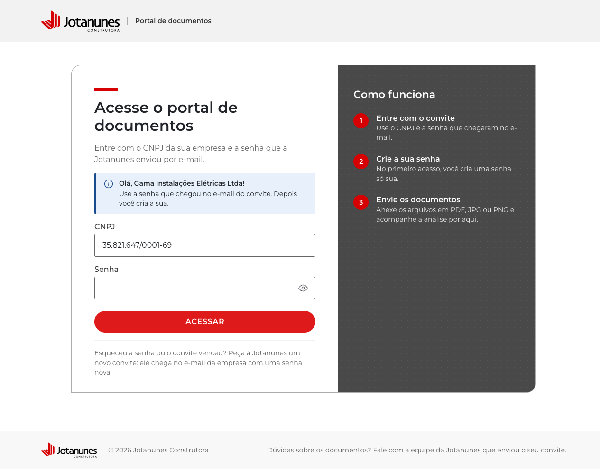

- **Objetivo da tela:** autenticar a empresa terceirizada por CNPJ e senha.
- **De onde é chamada:** do link do e-mail de convite, do endereço do portal, do botão "Sair" e de qualquer rota protegida acessada sem sessão válida.
- **Pode chamar:** a troca de senha obrigatória (primeiro acesso) ou "Meus documentos".
- **Usuários:** empresas terceirizadas convidadas.
- **Domínio:** CNPJ com máscara 00.000.000/0000-00, nos formatos numérico ou alfanumérico (14 caracteres); senha de até 128 caracteres.
- **Regras:** CNPJ obrigatório e com dígitos verificadores válidos; mensagens de erro não revelam se o CNPJ existe; bloqueio de 15 minutos após 5 tentativas erradas; convite vencido, link inválido ou empresa desativada são recusados com mensagem própria.
- **Lógica de negócio:** o link do convite é conferido na API antes do login; com senha provisória, a sessão só permite a troca de senha; com senha própria, a empresa vai direto aos documentos.

#### Tela 2 – Portal: Criar Nova Senha

Tela exibida no primeiro acesso, com o título "Crie uma nova senha para continuar.", os campos Senha atual, Nova senha e Confirme a nova senha, a lista de regras da senha marcadas conforme são atendidas e o botão "Salvar e continuar".

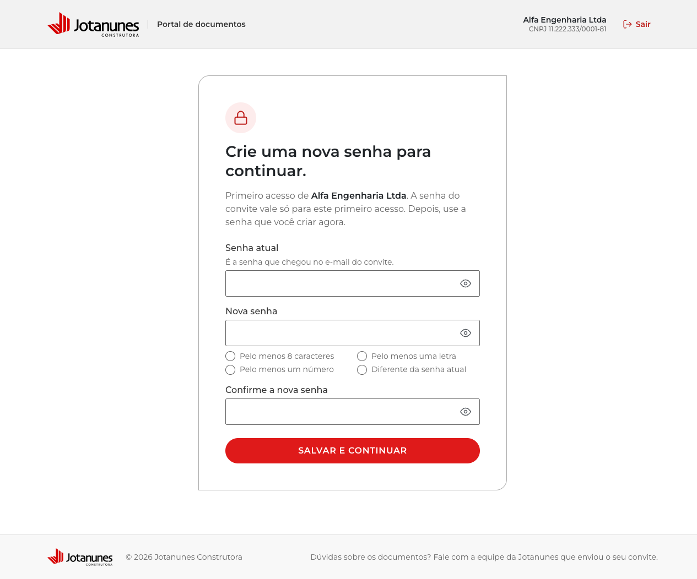

- **Objetivo da tela:** obrigar a empresa a trocar a senha provisória do convite por uma senha própria.
- **De onde é chamada:** do acesso com a senha do convite; também é a única tela alcançável enquanto a troca estiver pendente, mesmo digitando outro endereço.
- **Pode chamar:** "Meus documentos", com o aviso "Senha criada. Agora é só enviar os documentos.".
- **Usuários:** empresa terceirizada com troca de senha pendente.
- **Domínio:** três campos de senha de até 128 caracteres.
- **Regras:** nova senha com no mínimo 8 caracteres, ao menos uma letra e um número, diferente da atual; confirmação igual à nova senha.
- **Lógica de negócio:** a troca invalida a senha do convite e o link, marca o primeiro acesso e emite uma nova sessão; a ação é registrada na auditoria.

#### Tela 3 – Portal: Meus Documentos

Tela principal do portal. Mostra o resumo das quantidades por situação, a orientação "Faltam N documentos. Envie cada um em PDF, JPG ou PNG, com até 10 MB." e um cartão por documento exigido, com o selo de situação, o nome, as instruções, o arquivo enviado, o motivo da rejeição (quando houver), o botão "Enviar documento" ou "Enviar novo arquivo" e o link "Ver histórico de envios".

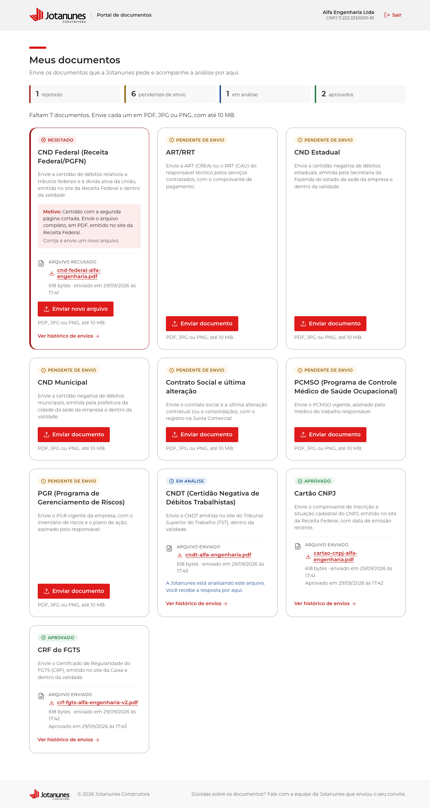

- **Objetivo da tela:** mostrar à empresa o que a Jotanunes exige, a situação de cada documento e permitir o envio dos arquivos.
- **De onde é chamada:** do acesso com senha própria, da troca de senha e do link "Voltar para meus documentos" no histórico.
- **Pode chamar:** o histórico do documento, o download do arquivo enviado e a tela de acesso (ao sair ou quando a sessão expira).
- **Usuários:** empresa terceirizada autenticada.
- **Domínio:** lista de tipos de documento ativos com situação Pendente de envio, Em análise, Aprovado ou Rejeitado; arquivo PDF, JPEG ou PNG de até 10 MB.
- **Regras:** envio permitido só para "Pendente de envio" e "Rejeitado"; formato conferido pelo conteúdo do arquivo; situação sempre escrita; sem pendências, exibe "Nenhum documento pendente. Tudo certo por aqui.".
- **Lógica de negócio:** ao enviar, a situação passa a "Em análise" e o envio aparece com nome, tamanho e data; se outro envio para o mesmo documento já tiver sido aceito, a tela é atualizada e informa que o documento está em análise.

#### Tela 4 – Portal: Histórico do Documento

Tela de um documento específico, com as instruções, a situação atual, a opção de envio quando permitida e a lista de todos os envios, do mais recente para o mais antigo, com data de envio, tamanho, data da análise e motivo da rejeição.

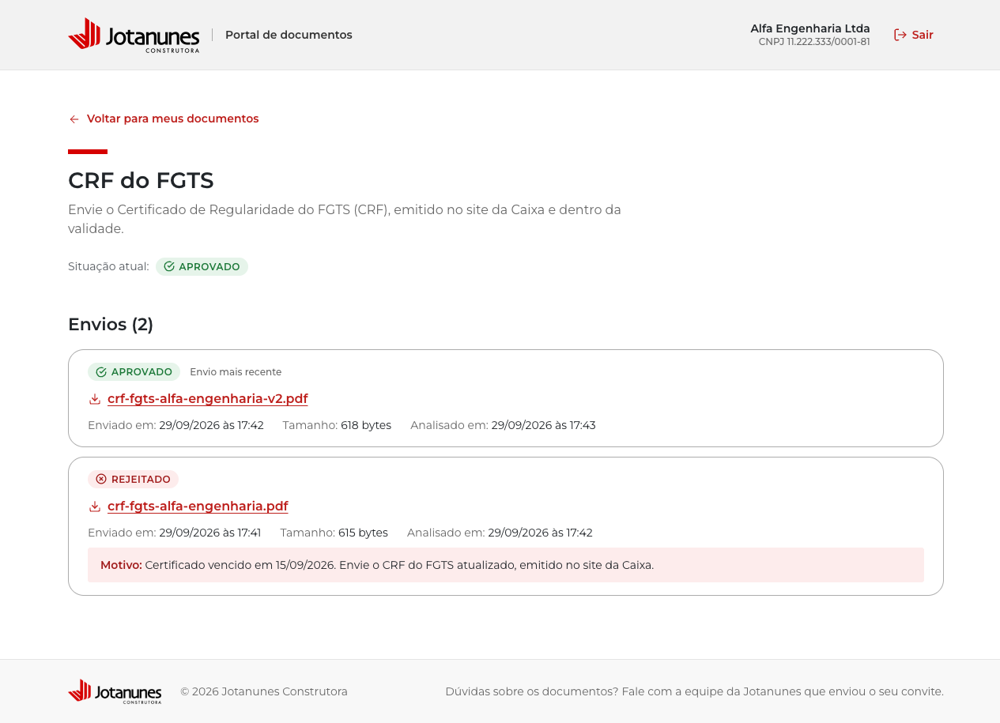

- **Objetivo da tela:** permitir que a empresa acompanhe todos os envios de um documento e baixe os próprios arquivos.
- **De onde é chamada:** do link "Ver histórico de envios" em "Meus documentos".
- **Pode chamar:** "Meus documentos" e o download de cada arquivo.
- **Usuários:** empresa terceirizada autenticada.
- **Domínio:** envios do documento com arquivo, tamanho, datas, situação e motivo.
- **Regras:** a empresa vê apenas os próprios envios; o nome de quem analisou não é exibido; documento de outra empresa é tratado como inexistente.
- **Lógica de negócio:** o envio mais recente define a situação atual; ao reenviar um documento rejeitado a partir desta tela, a situação volta a "Em análise" e a mensagem "Recebemos o arquivo. Agora é com a Jotanunes." é exibida.

#### Tela 5 – Área Jotanunes: Login

Tela exibida quando a área Jotanunes é aberta sem token e com o login próprio ligado. Traz o logo da Jotanunes no painel de acesso, o título "Acesse a documentação de terceirizadas", os campos Login e Senha, o botão "Acessar" e a orientação para quem esqueceu a senha.

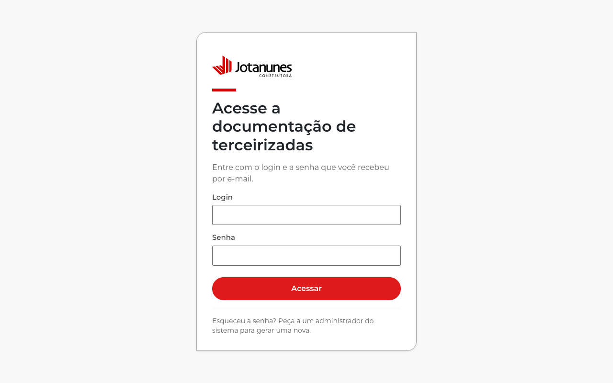

- **Objetivo da tela:** autenticar o usuário interno da Jotanunes com login e senha próprios.
- **De onde é chamada:** do endereço da área Jotanunes aberto fora do Fluig, do botão "Sair" e de qualquer sessão de login próprio revogada ou expirada.
- **Pode chamar:** a troca de senha obrigatória ou o painel.
- **Usuários:** usuários internos (administradores e comuns).
- **Domínio:** login de 3 a 100 caracteres, sem diferenciar maiúsculas; senha de até 128 caracteres.
- **Regras:** mesma mensagem para login inexistente e senha errada; bloqueio de 15 minutos após 5 falhas, com o horário de liberação; usuário desativado e senha provisória vencida recusados com mensagem própria.
- **Lógica de negócio:** a tela não mostra nenhum dado; a sessão criada carrega o perfil do cadastro e a indicação de troca de senha pendente.

#### Tela 6 – Área Jotanunes: Troca de Senha

A troca de senha tem dois modos. No modo obrigatório, após o primeiro acesso com senha provisória, é a única tela disponível, com o título "Crie uma nova senha para continuar." e as opções "Salvar e continuar" e "Sair". No modo voluntário, é aberta pelo item "Trocar senha" do menu, com "Salvar nova senha" e "Cancelar".

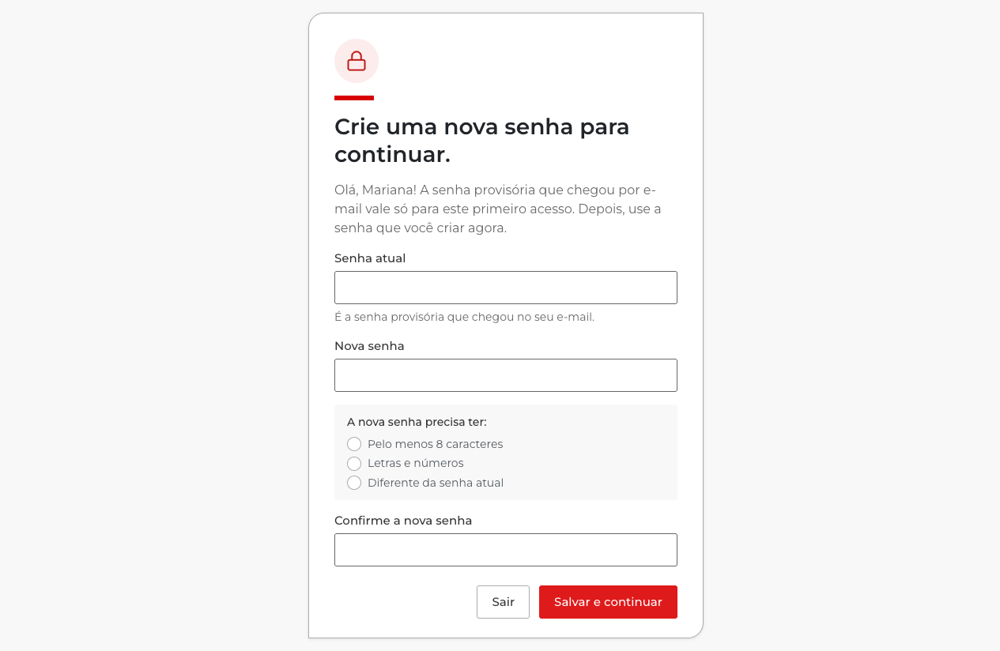

- **Objetivo da tela:** substituir a senha provisória ou trocar a senha atual do usuário interno.
- **De onde é chamada:** do login com senha provisória (obrigatória) ou do menu lateral (voluntária).
- **Pode chamar:** o painel, com o aviso "Senha alterada.", ou a tela de login ao sair.
- **Usuários:** usuários internos em sessão de login próprio.
- **Domínio:** senha atual, nova senha e confirmação, até 128 caracteres.
- **Regras:** as mesmas regras de senha do portal; na sessão aberta pelo Fluig a opção não existe e o endereço redireciona ao painel.
- **Lógica de negócio:** a troca invalida as outras sessões do usuário e emite uma nova sessão para a aba atual; a ação é registrada na auditoria.

#### Tela 7 – Área Jotanunes: Painel

Tela inicial da área Jotanunes. Cumprimenta o usuário pelo primeiro nome e mostra os cartões "Precisa de atenção" (documentos aguardando análise, empresas com pendência, empresas convidadas que ainda não acessaram o portal) e "Cadastros" (empresas ativas e obras ativas), cada um com atalhos para a lista correspondente já filtrada.

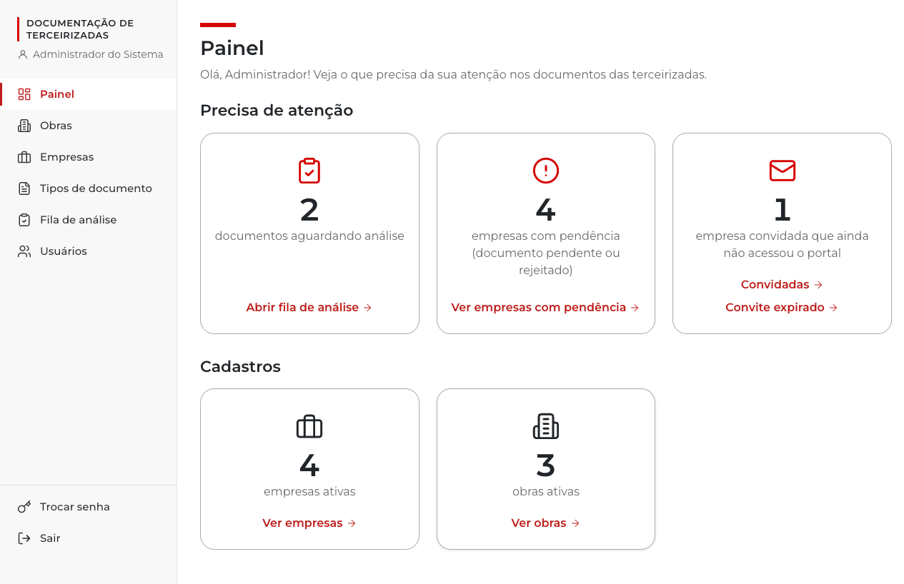

- **Objetivo da tela:** dar uma visão geral do que precisa de atenção no processo de documentação.
- **De onde é chamada:** da entrada pelo Fluig, do login, da troca de senha e do item "Painel" do menu.
- **Pode chamar:** Fila de análise, Empresas (filtradas por pendência, convidadas ou convite expirado) e Obras; pelo menu, todas as telas da área.
- **Usuários:** administradores e usuários comuns.
- **Domínio:** indicadores numéricos calculados a partir dos cadastros e envios.
- **Regras:** cartões de atenção com destaque visual apenas quando o número é maior que zero; para o usuário comum, exibe o aviso de que só administradores cadastram, alteram ou analisam.
- **Lógica de negócio:** os indicadores são calculados pela API a cada abertura do painel; a empresa com pendência é a que tem algum documento pendente de envio ou rejeitado.

#### Tela 8 – Área Jotanunes: Obras

Lista das obras com busca por nome, código ou cidade e filtro por situação. A tabela mostra obra e código, local, quantidade de empresas vinculadas e situação. O administrador vê o botão "Nova obra", que abre o formulário de cadastro.

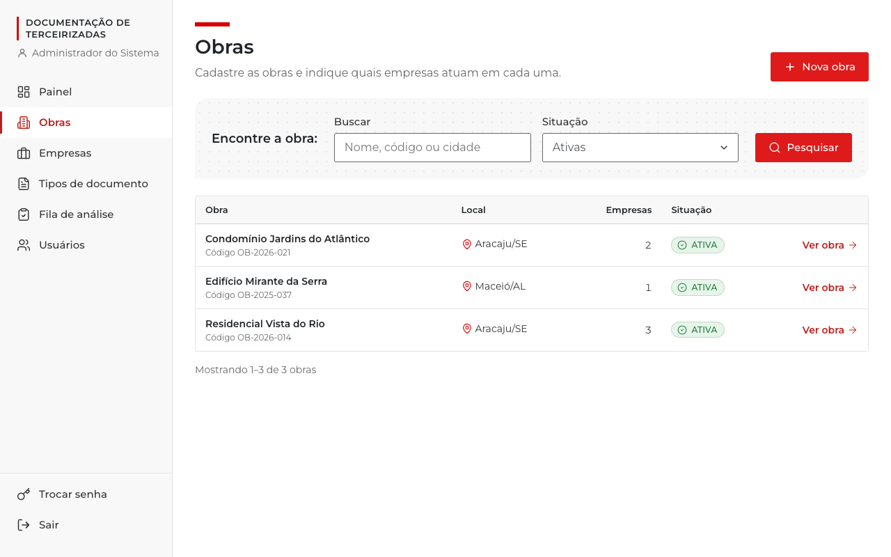

- **Objetivo da tela:** listar e localizar as obras e permitir o cadastro de novas obras.
- **De onde é chamada:** do menu lateral, do painel e do link "Voltar" no detalhe da obra.
- **Pode chamar:** o detalhe da obra e o formulário "Nova obra".
- **Usuários:** administradores (consulta e cadastro) e usuários comuns (consulta).
- **Domínio:** nome da obra, código interno opcional, cidade e UF.
- **Regras:** por padrão são exibidas as obras ativas; o cadastro exige nome, cidade e UF válidos.
- **Lógica de negócio:** após o cadastro, o sistema leva ao detalhe da obra com o aviso "Obra cadastrada. Agora vincule as empresas que trabalham nela.".

#### Tela 9 – Área Jotanunes: Detalhe da Obra

Mostra os dados da obra, as ações "Editar dados" e "Desativar obra" (ou "Ativar obra") para o administrador e a seção "Empresas da obra", com a situação de acesso ao portal, a contagem de documentos por situação e a data do vínculo de cada empresa. O botão "Vincular empresa" abre a busca de empresas por razão social, nome fantasia ou CNPJ.

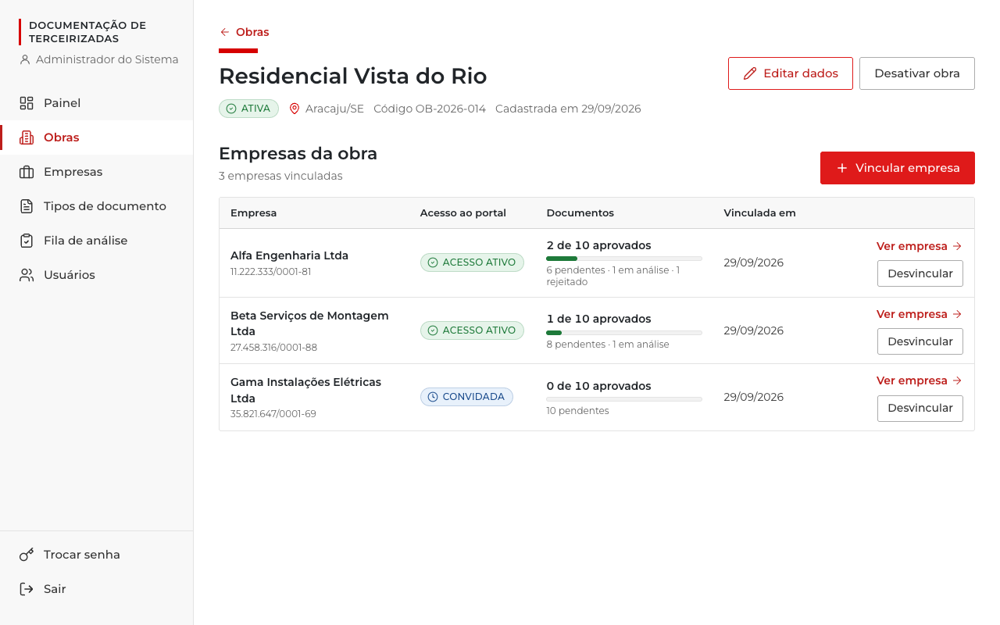

- **Objetivo da tela:** manter os dados da obra e as empresas que atuam nela, acompanhando o andamento dos documentos de cada uma.
- **De onde é chamada:** da lista de obras e do detalhe da empresa (lista de obras da empresa).
- **Pode chamar:** o detalhe de cada empresa, o modal de vínculo e as confirmações de desvincular e desativar.
- **Usuários:** administradores (edição e vínculos) e usuários comuns (consulta).
- **Domínio:** dados da obra; lista de empresas vinculadas com contagens de documentos por situação.
- **Regras:** vincular de novo a mesma empresa não duplica (a busca indica "Já vinculada"); desvincular e desativar pedem confirmação; obra inativa mantém os vínculos e mostra um aviso.
- **Lógica de negócio:** o vínculo é informativo, pois os documentos são exigidos por empresa; desvincular não altera os documentos nem o acesso da empresa ao portal.

#### Tela 10 – Área Jotanunes: Empresas

Lista das empresas terceirizadas com busca por nome ou CNPJ, filtros por obra, situação de acesso ao portal e "Com pendência". A tabela mostra empresa, CNPJ formatado, acesso ao portal e resumo dos documentos. O administrador vê "Nova empresa", que abre o formulário com razão social, nome fantasia, CNPJ, e-mail de contato, nome do contato e telefone.

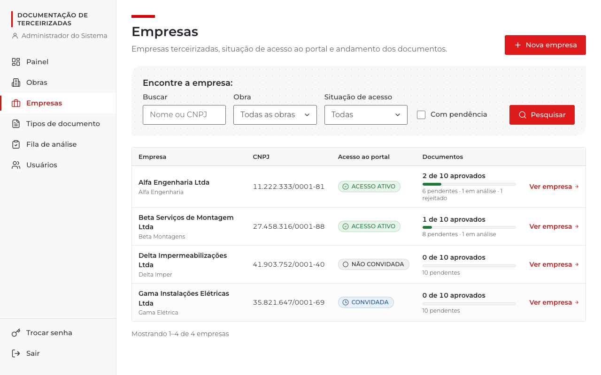

- **Objetivo da tela:** listar, localizar e cadastrar as empresas terceirizadas.
- **De onde é chamada:** do menu lateral, dos atalhos do painel e do link "Voltar" no detalhe da empresa.
- **Pode chamar:** o detalhe da empresa e o formulário "Nova empresa".
- **Usuários:** administradores (consulta e cadastro) e usuários comuns (consulta).
- **Domínio:** razão social, nome fantasia, CNPJ numérico ou alfanumérico, e-mail de contato, nome do contato e telefone.
- **Regras:** CNPJ validado e único; e-mail de contato válido; situação de acesso exibida em texto.
- **Lógica de negócio:** após o cadastro, a empresa aparece como "Não convidada" e o sistema orienta a vincular a empresa a uma obra e enviar o convite.

#### Tela 11 – Área Jotanunes: Detalhe da Empresa

Reúne os dados da empresa (em modo leitura para o usuário comum e editáveis para o administrador), as obras em que atua, a seção "Acesso ao portal" com a situação, o último convite, o último acesso, o botão "Enviar convite" ou "Reenviar convite" e o histórico de convites, e a seção "Documentos" com a situação de cada documento exigido, o envio atual, a análise, o histórico por tipo e os tipos desativados com envios anteriores.

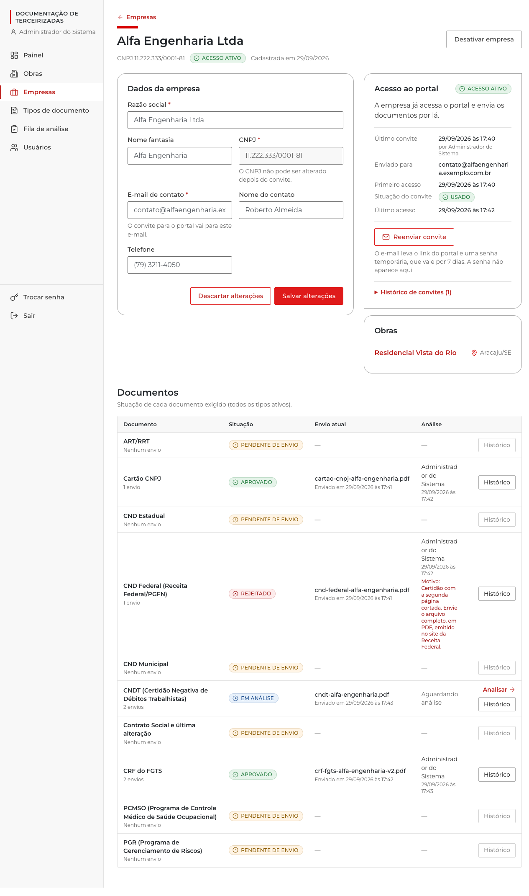

- **Objetivo da tela:** concentrar tudo sobre uma empresa: cadastro, obras, convite e documentos.
- **De onde é chamada:** da lista de empresas, do detalhe da obra e da análise do envio.
- **Pode chamar:** o detalhe das obras da empresa, o envio de convite, o histórico de cada documento, a abertura dos arquivos e a análise dos envios.
- **Usuários:** administradores (edição, ativação e análise) e usuários comuns (consulta e convite).
- **Domínio:** dados cadastrais; situação de acesso Não convidada, Convidada, Convite expirado, Ativa ou Desativada; documentos com situação e histórico.
- **Regras:** o CNPJ fica bloqueado para edição depois do primeiro convite; empresa desativada não recebe convite; o reenvio pede confirmação; desativar a empresa bloqueia o acesso ao portal na hora.
- **Lógica de negócio:** o convite gera nova senha provisória e novo link, invalida os anteriores e muda a situação para "Convidada"; se o e-mail falhar, a situação não muda e a mensagem "Não conseguimos enviar o convite. Tente de novo em alguns minutos." é exibida.

#### Tela 12 – Área Jotanunes: Tipos de Documento

Lista do catálogo de tipos de documento com filtro por situação, mostrando nome, resumo das instruções, situação e data de cadastro. O administrador cadastra ("Novo tipo de documento"), edita e ativa ou desativa tipos. Numa instalação nova, a lista já traz os 10 tipos do catálogo padrão.

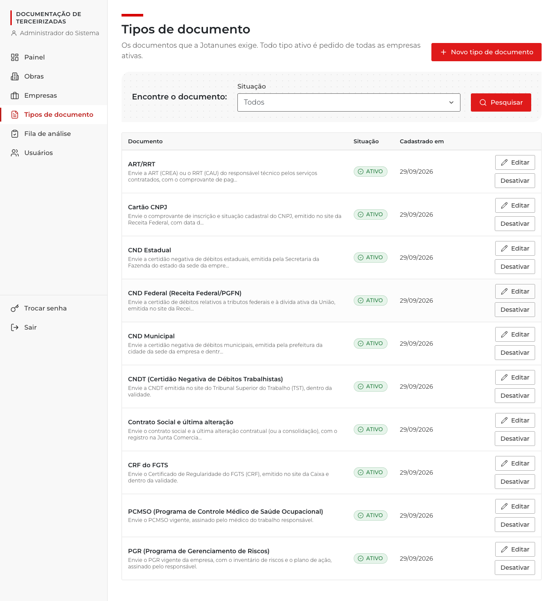

- **Objetivo da tela:** manter o catálogo de documentos exigidos das empresas.
- **De onde é chamada:** do menu lateral e da seção "Documentos" do detalhe da empresa, quando não há tipos ativos.
- **Pode chamar:** os formulários de cadastro e edição e a confirmação de ativar ou desativar.
- **Usuários:** administradores (manutenção) e usuários comuns (consulta).
- **Domínio:** nome de 3 a 120 caracteres, único sem diferenciar maiúsculas; instruções para a empresa de até 1.000 caracteres.
- **Regras:** nada é excluído, apenas desativado; a desativação pede confirmação e explica o efeito.
- **Lógica de negócio:** um tipo novo passa a ser exigido na hora de todas as empresas ativas ("Pendente de envio"); um tipo desativado deixa de ser exigido, mas os envios já feitos continuam no histórico.

#### Tela 13 – Área Jotanunes: Fila de Análise

Lista dos envios aguardando análise, do mais antigo para o mais novo, com filtros por situação, obra, empresa e documento. A tabela mostra empresa, documento, arquivo e data de envio, com o link "Analisar" (administrador) ou "Ver" (usuário comum). Filtrando por aprovados ou rejeitados, a lista passa a mostrar os envios já analisados.

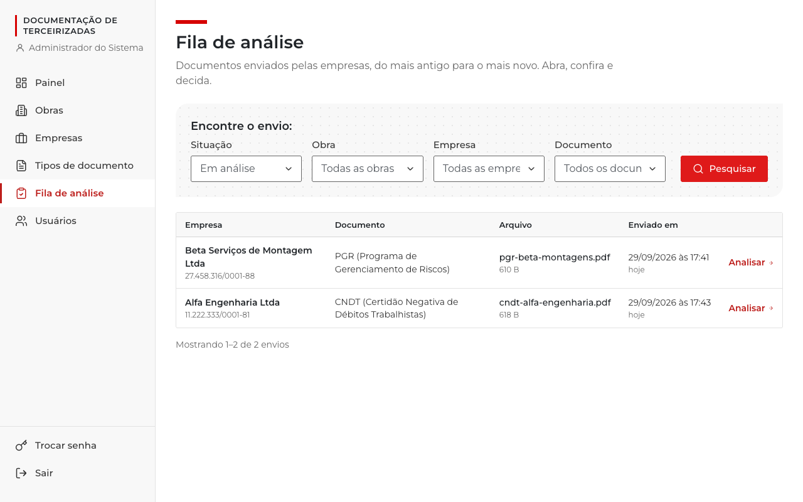

- **Objetivo da tela:** organizar o trabalho de análise dos documentos recebidos.
- **De onde é chamada:** do menu lateral, do painel e do link "Voltar" na análise do envio.
- **Pode chamar:** a análise do envio.
- **Usuários:** administradores (análise) e usuários comuns (consulta).
- **Domínio:** envios com empresa, tipo de documento, nome do arquivo, data de envio e situação.
- **Regras:** envios "Em análise" do mais antigo para o mais novo; analisados do mais recente para o mais antigo; lista vazia exibe "Nenhum documento aguardando análise.".
- **Lógica de negócio:** a fila inclui envios de tipos desativados depois do envio, que ainda podem ser concluídos.

#### Tela 14 – Área Jotanunes: Análise do Envio

Mostra o tipo de documento, o arquivo enviado (formato e tamanho) com o botão "Abrir arquivo", as instruções do documento, os dados da empresa e o bloco de decisão com "Aprovar" e "Rejeitar". A rejeição abre um formulário com o campo "Motivo da rejeição". Para envios já analisados, o bloco mostra o resultado, quem decidiu, quando e o motivo.

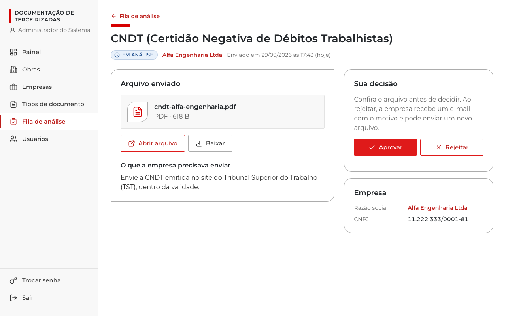

- **Objetivo da tela:** permitir que o administrador confira o arquivo e decida sobre o envio.
- **De onde é chamada:** da fila de análise e da seção "Documentos" do detalhe da empresa.
- **Pode chamar:** a abertura do arquivo, as confirmações de aprovar e rejeitar, o detalhe da empresa e a fila de análise.
- **Usuários:** administradores (decisão) e usuários comuns (consulta e abertura do arquivo).
- **Domínio:** envio com arquivo, formato, tamanho, datas e situação; motivo da rejeição de 5 a 500 caracteres.
- **Regras:** só envios "Em análise" podem ser decididos; aprovar pede confirmação; rejeitar exige motivo; para o usuário comum aparece "Este documento aguarda a decisão de um administrador.".
- **Lógica de negócio:** a decisão registra quem decidiu e quando e é definitiva; se outra pessoa decidiu antes, a segunda decisão é recusada informando que o envio já foi analisado; na rejeição, a empresa recebe e-mail com o motivo.

#### Tela 15 – Área Jotanunes: Usuários

Lista dos usuários internos com busca por nome, login ou e-mail e filtros por situação e perfil. A tabela mostra usuário, perfil, situação, último acesso e as ações "Editar", "Redefinir senha" e "Desativar" ou "Reativar"; a linha do próprio administrador é marcada com "Você". O botão "Novo usuário" abre o formulário com nome, e-mail, login e a opção de administrador.

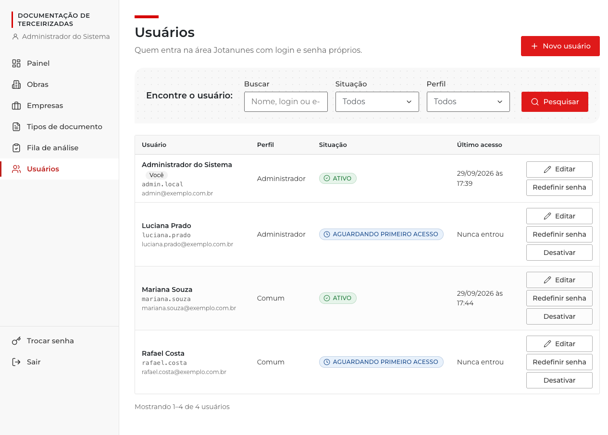

- **Objetivo da tela:** gerenciar quem entra na área Jotanunes pelo login próprio.
- **De onde é chamada:** do item "Usuários" do menu lateral, exibido apenas para administradores.
- **Pode chamar:** os formulários de cadastro e edição e as confirmações de redefinir senha e desativar ou reativar.
- **Usuários:** somente administradores; o usuário comum que abre o endereço vê apenas o aviso de tela restrita.
- **Domínio:** nome de 3 a 150 caracteres, e-mail válido, login de 3 a 100 caracteres (letras sem acento, números, ponto, hífen e sublinhado) e perfil.
- **Regras:** login único e imutável; não é possível desativar a si mesmo nem tirar o próprio papel de administrador; o último administrador ativo não pode ser desativado nem perder o papel; a senha provisória nunca aparece na tela.
- **Lógica de negócio:** cadastrar e redefinir senha enviam e-mail com a senha provisória e só são gravados se o e-mail sair; desativar, redefinir a senha e mudar o papel derrubam as sessões abertas do usuário.

#### Tela 16 – Área Jotanunes: Abra pelo Fluig

Tela exibida quando a área Jotanunes é aberta sem identidade válida e o login próprio está desligado por configuração. Mostra apenas o título "Abra este sistema pelo Fluig.", a explicação e a orientação de procurar a TI da Jotanunes.

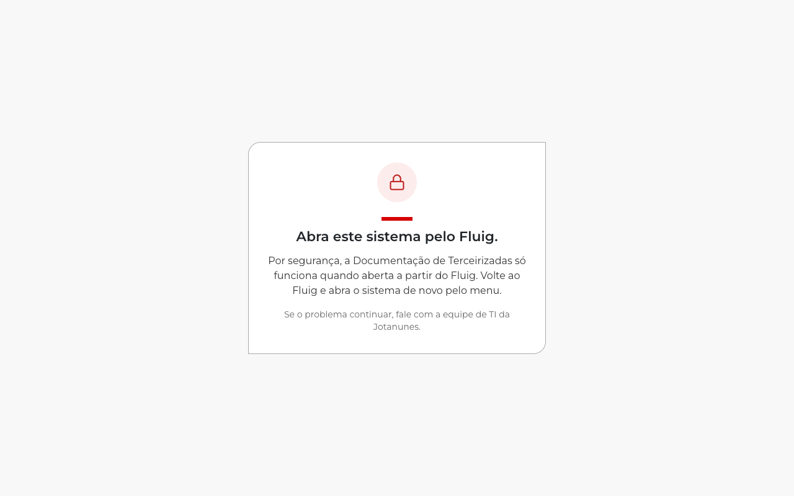

- **Objetivo da tela:** impedir o acesso sem identidade válida quando só a entrada pelo Fluig está habilitada.
- **De onde é chamada:** da abertura da área Jotanunes fora do Fluig, com o login próprio desligado.
- **Pode chamar:** nenhuma tela; o usuário deve voltar ao Fluig e abrir o sistema pelo menu.
- **Usuários:** qualquer pessoa sem identidade válida.
- **Domínio:** tela apenas informativa, sem campos.
- **Regras:** nenhum dado do sistema é exibido.
- **Lógica de negócio:** antes de escolher entre esta tela e a de login, a área Jotanunes consulta a API para saber se o login próprio está ligado.

#### Requisitos de Usabilidade do Protótipo

As interfaces priorizam a facilidade de uso, a organização visual e a rápida identificação das ações disponíveis. Cada tela tem título e descrição curta do que faz, e as ações principais ficam em destaque, como "Enviar documento" no portal e "Analisar" na fila. As listas têm busca, filtros e estados de carregamento, vazio e erro com mensagens que dizem o que fazer. Ações com efeito relevante (desativar, desvincular, reenviar convite, aprovar, redefinir senha) pedem confirmação e explicam o efeito antes de executar.

A identidade visual segue o guia de design da Jotanunes, com tipografia Montserrat, paleta com contraste WCAG AA e a forma-assinatura da marca. As situações são sempre escritas, nunca indicadas só por cor. As duas interfaces funcionam a partir de 360 px de largura: no portal os documentos aparecem em cartões, e na área Jotanunes o menu lateral vira o botão "Menu". Há link "Pular para o conteúdo", o foco é levado ao conteúdo a cada troca de página e os campos com erro recebem o foco com a mensagem ao lado.

#### Regras Gerais de Acesso e Segurança

Por tratar documentos de empresas e dados pessoais, o sistema adota controle de acesso em todas as camadas. A empresa terceirizada vê somente os próprios documentos, e qualquer tentativa de acessar dados de outra empresa é tratada como recurso inexistente. Na área Jotanunes, as ações de administrador são escondidas do usuário comum, mas a proteção real está no servidor, que recusa a operação antes de qualquer efeito e registra a tentativa na auditoria.

As credenciais das duas interfaces são separadas: o token do portal não vale na área Jotanunes e o contrário também. Senhas provisórias nunca aparecem na interface da Jotanunes, os arquivos não têm endereço público e toda sessão tem prazo máximo de 8 horas. Enquanto houver troca de senha pendente, a única tela acessível é a de troca.

#### Evolução Incremental do Protótipo

A construção das telas ocorreu de forma incremental, acompanhando as três rodadas de requisitos. Na primeira, foram construídos o portal completo (acesso, troca de senha, meus documentos e histórico) e a área Jotanunes aberta pelo Fluig (painel, obras, empresas, tipos de documento, fila e análise), com a tela "Abra este sistema pelo Fluig." para acessos sem identidade. Na segunda, as telas da área Jotanunes passaram a se adaptar ao perfil (ações escondidas, modo leitura e aviso para o usuário comum) e a tela de tipos de documento passou a exibir o catálogo padrão. Na terceira, foram acrescentadas a tela de login próprio, a troca de senha da área Jotanunes e a tela "Usuários", e a tela "Abra este sistema pelo Fluig." passou a aparecer apenas com o login próprio desligado.

A cada rodada, as telas foram verificadas contra o guia de design, testadas de forma automatizada e percorridas no roteiro E2E antes de serem consideradas concluídas.

#### Resumo das Telas do Protótipo

O sistema é composto por 16 telas, 4 no Portal da Terceirizada e 12 na Área Jotanunes, listadas a seguir. Esse conjunto cobre o fluxo essencial da solução e serve de base para os requisitos funcionais, as regras de negócio e os critérios de teste.

| Nº | Tela | Interface | Usuários | Arquivo da figura |
|---|---|---|---|---|
| 1 | Acesso | Portal | Empresa terceirizada | portal-01-login.png |
| 2 | Criar nova senha | Portal | Empresa terceirizada | portal-02-trocar-senha.png |
| 3 | Meus documentos | Portal | Empresa terceirizada | portal-03-meus-documentos.png |
| 4 | Histórico do documento | Portal | Empresa terceirizada | portal-04-historico.png |
| 5 | Login | Área Jotanunes | Usuário interno | fluig-01-login.png |
| 6 | Troca de senha | Área Jotanunes | Usuário interno | fluig-02-trocar-senha.png |
| 7 | Painel | Área Jotanunes | Administrador e comum | fluig-03-painel.png |
| 8 | Obras | Área Jotanunes | Administrador e comum | fluig-04-obras.png |
| 9 | Detalhe da obra | Área Jotanunes | Administrador e comum | fluig-05-obra-detalhe.png |
| 10 | Empresas | Área Jotanunes | Administrador e comum | fluig-06-empresas.png |
| 11 | Detalhe da empresa | Área Jotanunes | Administrador e comum | fluig-07-empresa-detalhe.png |
| 12 | Tipos de documento | Área Jotanunes | Administrador e comum | fluig-08-tipos-documento.png |
| 13 | Fila de análise | Área Jotanunes | Administrador e comum | fluig-09-fila-analise.png |
| 14 | Análise do envio | Área Jotanunes | Administrador e comum | fluig-10-analise-envio.png |
| 15 | Usuários | Área Jotanunes | Administrador | fluig-11-usuarios.png |
| 16 | Abra pelo Fluig | Área Jotanunes | Sem identidade válida | fluig-12-acesso-negado.png |

### 3.3.1. Diagrama de Navegação

O diagrama de navegação apresenta a sequência de acesso e interação entre as telas do sistema. O fluxo foi definido para que cada usuário chegue à sua tarefa principal com o menor número de passos: a empresa, ao envio dos documentos; a equipe Jotanunes, aos cadastros, ao convite e à análise.

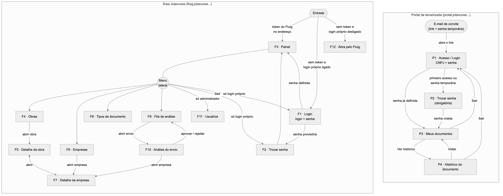

#### Sequência de Navegação

1. **[1] Área Jotanunes – entrada:** com token do Fluig, vai direto ao Painel; sem token, mostra o Login (login próprio ligado) ou "Abra pelo Fluig" (desligado).
2. **[2] Login:** o usuário interno informa login e senha.
3. **[3] Troca de senha obrigatória:** exigida quando a senha é provisória.
4. **[4] Painel:** indicadores e atalhos; a partir dele, o menu lateral dá acesso às demais telas.
5. **[5] Obras → Detalhe da obra:** cadastro da obra e vínculo das empresas.
6. **[6] Empresas → Detalhe da empresa:** cadastro da empresa e envio do convite.
7. **[7] Tipos de documento:** manutenção do catálogo exigido.
8. **[8] Portal – Acesso:** a empresa abre o link do convite e entra com CNPJ e senha provisória.
9. **[9] Portal – Criar nova senha:** a empresa cria a própria senha.
10. **[10] Portal – Meus documentos → Histórico:** a empresa envia os arquivos e acompanha a situação.
11. **[11] Fila de análise → Análise do envio:** a Jotanunes abre o arquivo e aprova ou rejeita.
12. **[12] Portal – Meus documentos:** a empresa vê o resultado e reenvia o que foi rejeitado, voltando ao passo 11.
13. **[13] Usuários:** o administrador gerencia os usuários internos, a qualquer momento, pelo menu.

#### Fluxo Principal

O fluxo principal começa na área Jotanunes. O administrador entra pelo Fluig ou pelo login próprio (trocando a senha provisória no primeiro acesso) e chega ao Painel. Pelo menu, confere os tipos de documento, cadastra a obra, cadastra a empresa e a vincula à obra. No detalhe da empresa, clica em "Enviar convite", e a empresa recebe o e-mail com o link e a senha provisória.

A empresa abre o link, que leva à tela de acesso do portal com o CNPJ preenchido, entra com a senha provisória e cria a nova senha. Em "Meus documentos", envia um arquivo para cada documento pendente, e cada um passa a "Em análise".

Na área Jotanunes, o envio aparece no Painel e na Fila de análise. O administrador abre o envio, confere o arquivo e aprova ou rejeita com motivo. Se rejeitar, a empresa recebe um e-mail, vê o motivo em "Meus documentos" e envia um novo arquivo, que volta à fila. O ciclo termina quando todos os documentos da empresa estão aprovados.

#### Fluxos Alternativos e Exceções

- **Login próprio desligado:** sem token do Fluig, a área Jotanunes mostra "Abra este sistema pelo Fluig." e não permite nenhuma outra navegação.
- **Senha errada ou conta inexistente:** a tela de login (portal ou área Jotanunes) mostra a mesma mensagem genérica; após 5 falhas, informa o bloqueio de 15 minutos.
- **Convite vencido ou link inválido:** o portal mostra a tela de acesso com a mensagem correspondente e orienta a pedir um novo convite à Jotanunes, que usa "Reenviar convite" no detalhe da empresa.
- **Senha provisória do usuário interno vencida ou esquecida:** o usuário pede a um administrador, que usa "Redefinir senha" na tela Usuários.
- **Arquivo recusado:** formato, tamanho ou conteúdo inválido mantém a empresa em "Meus documentos" com a mensagem dos formatos e do tamanho aceitos.
- **Envio já analisado por outra pessoa:** a análise do envio informa que o envio já foi analisado e mostra o resultado.
- **Usuário comum em ação de administrador:** as ações não aparecem; se a API recusar uma ação feita a partir de uma tela antiga, a mensagem é exibida sem sair da tela e sem perder os dados.
- **Sessão revogada ou expirada:** a próxima ação leva de volta à tela de login (área Jotanunes) ou de acesso (portal); no portal, um envio interrompido precisa ser refeito.
- **Endereço inexistente:** na área Jotanunes, exibe a tela "Página não encontrada"; no portal, redireciona para "Meus documentos".

#### Representação Simplificada do Diagrama

A representação abaixo resume a navegação principal do sistema:

```text
ÁREA JOTANUNES                                   PORTAL DA TERCEIRIZADA

Fluig (token) ──────────────┐                    E-mail de convite
Sem token ─► LOGIN ─► TROCA DE SENHA*                   │
Login desligado ─► ABRA PELO FLUIG                      ▼
                            ▼                    ACESSO (CNPJ + senha)
                         PAINEL                         │
        ┌──────────┬────────┼───────────┬─────────┐    ▼
        ▼          ▼        ▼           ▼         ▼  CRIAR NOVA SENHA*
     OBRAS     EMPRESAS   TIPOS DE   FILA DE   USUÁRIOS │
        │          │      DOCUMENTO  ANÁLISE   (admin)  ▼
        ▼          ▼                    │        MEUS DOCUMENTOS ◄──┐
   DETALHE ◄─► DETALHE DA               ▼               │           │
   DA OBRA     EMPRESA ─► convite ─► ANÁLISE DO         ▼           │
                                     ENVIO        HISTÓRICO DO      │
                                        │         DOCUMENTO         │
                                        └── rejeição (e-mail) ──────┘

* somente quando a senha é provisória
```

O diagrama representa o fluxo da versão implantada. Novas telas poderão ser acrescentadas conforme novos requisitos forem validados, sem alterar a estrutura principal de acesso.

## 3.4. Métricas e Cronograma

Este tópico apresenta a estimativa de esforço para o desenvolvimento do sistema pela técnica de Pontos de Caso de Uso, os recursos envolvidos e o cronograma real de execução, reconstruído a partir do histórico de versões do repositório.

#### Técnica de Estimativa

Para estimar o tamanho e o esforço do sistema foi adotada a técnica de Pontos de Caso de Uso (UCP, *Use Case Points*), proposta por Gustav Karner, adequada quando as funcionalidades podem ser representadas por atores e casos de uso. A técnica soma o peso dos atores (UAW) e dos casos de uso (UUCW), ajusta o total pelos fatores técnicos (TCF) e ambientais (ECF) e converte o resultado em horas por meio de um índice de produtividade. A estimativa foi calculada sobre o escopo final da especificação, incluindo as três rodadas de requisitos.

#### Peso dos Atores (UAW)

Os atores são classificados como simples (outro sistema acessado por API, peso 1), médios (outro sistema por protocolo ou pessoa por interface de texto ou linha de comando, peso 2) e complexos (pessoa por interface gráfica, peso 3).

| Ator | Forma de interação | Classificação | Peso |
|---|---|---|---|
| Administrador Jotanunes | Interface gráfica web | Complexo | 3 |
| Usuário comum Jotanunes | Interface gráfica web | Complexo | 3 |
| Empresa terceirizada | Interface gráfica web (portal) | Complexo | 3 |
| Responsável pela instalação | Comando de linha no servidor | Médio | 2 |
| Fluig | Token de identidade assinado (JWT) | Simples | 1 |
| Resend | API HTTP de envio de e-mail | Simples | 1 |

| Categoria | Quantidade | Peso | Cálculo | Resultado |
|---|---|---|---|---|
| Atores simples | 2 | 1 | 2 × 1 | 2 |
| Atores médios | 1 | 2 | 1 × 2 | 2 |
| Atores complexos | 3 | 3 | 3 × 3 | 9 |
| **UAW** | | | | **13** |

#### Peso dos Casos de Uso (UUCW)

Os casos de uso são classificados pelo número de transações (passos de interação entre ator e sistema, incluindo os fluxos alternativos relevantes): simples, até 3 transações (peso 5); médio, de 4 a 7 transações (peso 10); complexo, mais de 7 transações (peso 15). O registro de auditoria é tratado como parte (inclusão) dos demais casos de uso e não foi contado separadamente.

| Nº | Caso de uso | Principais transações | Nº de transações | Complexidade | Peso |
|---|---|---|---|---|---|
| UC01 | Autenticar na área Jotanunes | verificar configuração; entrar pelo Fluig; entrar com login; recusar credencial; bloquear após falhas; sair | 6 | Médio | 10 |
| UC02 | Trocar senha do usuário interno | trocar obrigatória; trocar voluntária; validar regras | 3 | Simples | 5 |
| UC03 | Gerenciar usuários internos | listar; filtrar; cadastrar com e-mail; editar; mudar perfil; desativar; reativar; redefinir senha; proteger último administrador | 9 | Complexo | 15 |
| UC04 | Criar primeiro administrador | criar; recusar se já existe; forçar recuperação | 3 | Simples | 5 |
| UC05 | Manter obras | listar; buscar e filtrar; cadastrar; editar; ativar ou desativar | 5 | Médio | 10 |
| UC06 | Vincular empresas à obra | consultar empresas da obra; buscar empresa; vincular; desvincular | 4 | Médio | 10 |
| UC07 | Manter empresas | listar; buscar; filtrar por obra, acesso e pendência; cadastrar; validar CNPJ; recusar duplicado; editar; bloquear CNPJ após convite; ativar ou desativar | 9 | Complexo | 15 |
| UC08 | Manter tipos de documento | listar; filtrar; cadastrar; editar; ativar ou desativar | 5 | Médio | 10 |
| UC09 | Criar catálogo padrão | verificar catálogo vazio; criar 10 tipos; evitar duplicação | 3 | Simples | 5 |
| UC10 | Convidar empresa | enviar convite; gerar senha e link; enviar e-mail; reenviar invalidando anterior; consultar convites | 5 | Médio | 10 |
| UC11 | Consultar painel | calcular indicadores; navegar pelos atalhos | 2 | Simples | 5 |
| UC12 | Acompanhar documentos da empresa | listar situação por documento; ver histórico; ver tipos desativados; abrir arquivo | 4 | Médio | 10 |
| UC13 | Analisar envio | listar fila; filtrar; consultar analisados; abrir envio; abrir arquivo; aprovar; rejeitar com motivo; avisar empresa por e-mail; recusar decisão concorrente | 9 | Complexo | 15 |
| UC14 | Acessar o portal | validar link do convite; entrar com CNPJ e senha; recusar convite vencido; bloquear após falhas; sair | 5 | Médio | 10 |
| UC15 | Criar senha no portal | trocar senha provisória; validar regras | 2 | Simples | 5 |
| UC16 | Enviar documento | listar exigidos; escolher arquivo; validar formato; validar tamanho; validar conteúdo; gravar envio; atualizar situação; reenviar rejeitado; recusar envio concorrente | 9 | Complexo | 15 |
| UC17 | Consultar histórico no portal | listar envios do documento; baixar arquivo | 2 | Simples | 5 |

| Categoria | Quantidade | Peso | Cálculo | Resultado |
|---|---|---|---|---|
| Simples | 6 | 5 | 6 × 5 | 30 |
| Médios | 7 | 10 | 7 × 10 | 70 |
| Complexos | 4 | 15 | 4 × 15 | 60 |
| **UUCW** | | | | **160** |

Assim, os Pontos de Caso de Uso não ajustados são: UUCP = UAW + UUCW = 13 + 160 = 173.

#### Fatores de Complexidade Técnica (TCF)

Cada um dos 13 fatores técnicos recebe uma nota de 0 (irrelevante) a 5 (essencial), multiplicada pelo peso do fator.

| Fator | Descrição | Peso | Nota | Resultado | Justificativa |
|---|---|---|---|---|---|
| T1 | Sistema distribuído | 2 | 4 | 8,0 | Uma API e duas aplicações web separadas, com a área Jotanunes embutida no Fluig. |
| T2 | Desempenho | 1 | 3 | 3,0 | Meta de listas em até 2 s com 20.000 envios, sem requisitos de tempo real. |
| T3 | Eficiência para o usuário final | 1 | 3 | 3,0 | Tarefas rápidas (cadastro e convite em menos de 3 minutos), com filtros e atalhos. |
| T4 | Processamento interno complexo | 1 | 3 | 3,0 | Máquina de estados dos envios, concorrência na análise e regras de perfil e revogação. |
| T5 | Código reutilizável | 1 | 2 | 2,0 | Reuso interno (componentes, portas e adaptadores), sem objetivo de biblioteca para terceiros. |
| T6 | Facilidade de instalação | 0,5 | 3 | 1,5 | Scripts de implantação, migrações automáticas e comando para o primeiro administrador. |
| T7 | Facilidade de uso | 0,5 | 4 | 2,0 | Público externo (empresas) sem treinamento, acessibilidade WCAG AA e uso no celular. |
| T8 | Portabilidade | 2 | 2 | 4,0 | Navegadores atuais e servidor Linux; não há exigência de outras plataformas. |
| T9 | Facilidade de alteração | 1 | 4 | 4,0 | Requisitos mudaram durante o projeto; arquitetura hexagonal e contrato como fonte de verdade. |
| T10 | Concorrência | 1 | 3 | 3,0 | Vários analistas e empresas simultâneos, com decisões e envios concorrentes tratados. |
| T11 | Segurança | 1 | 5 | 5,0 | Autenticação por três origens, isolamento entre empresas, bloqueio, auditoria e LGPD. |
| T12 | Acesso direto de terceiros | 1 | 5 | 5,0 | Empresas externas acessam o sistema diretamente pelo portal. |
| T13 | Necessidade de treinamento | 1 | 1 | 1,0 | Telas autoexplicativas; manual do usuário suficiente. |
| **Total (TFactor)** | | | | **44,5** | |

TCF = 0,6 + (0,01 × TFactor) = 0,6 + (0,01 × 44,5) = 0,6 + 0,445 = **1,045**.

#### Fatores Ambientais (ECF)

Cada um dos 8 fatores ambientais recebe uma nota de 0 a 5, multiplicada pelo peso do fator.

| Fator | Descrição | Peso | Nota | Resultado | Justificativa |
|---|---|---|---|---|---|
| E1 | Familiaridade com o processo de desenvolvimento | 1,5 | 3 | 4,5 | Uso do Spec Kit e de agentes de IA ainda recente para a equipe. |
| E2 | Experiência na aplicação | 0,5 | 2 | 1,0 | Primeiro contato com o domínio de documentação de terceirizadas e com o Fluig. |
| E3 | Experiência em orientação a objetos | 1 | 4 | 4,0 | Boa experiência com C# e TypeScript. |
| E4 | Capacidade do analista líder | 0,5 | 4 | 2,0 | Especificação detalhada e decisões registradas e validadas. |
| E5 | Motivação | 1 | 5 | 5,0 | Projeto real, com cliente e implantação em produção. |
| E6 | Estabilidade dos requisitos | 2 | 3 | 6,0 | Duas mudanças relevantes durante o projeto (perfis e login próprio). |
| E7 | Trabalhadores em tempo parcial | −1 | 3 | −3,0 | Equipe da residência com dedicação parcial. |
| E8 | Dificuldade da linguagem de programação | −1 | 2 | −2,0 | C#, TypeScript e SQL, tecnologias maduras e conhecidas. |
| **Total (EFactor)** | | | | **17,5** | |

ECF = 1,4 + (−0,03 × EFactor) = 1,4 − (0,03 × 17,5) = 1,4 − 0,525 = **0,875**.

#### Pontos de Caso de Uso Ajustados e Esforço

UCP = UUCP × TCF × ECF = 173 × 1,045 × 0,875 = 180,785 × 0,875 ≈ **158,19 UCP**.

Para a produtividade foi adotado o critério de Schneider e Winters: conta-se quantos fatores de E1 a E6 têm nota menor que 3 e quantos de E7 e E8 têm nota maior que 3. Neste projeto, apenas E2 se enquadra (total 1), o que indica 20 horas por UCP, o mesmo valor sugerido por Karner.

Esforço estimado = 158,19 × 20 ≈ **3.163,8 horas**. Esse valor representa o esforço total de uma equipe tradicional, e não horas corridas de calendário, distribuído entre análise, especificação, prototipação, backend, interfaces, testes, integração, implantação e documentação.

| Indicador | Valor estimado |
|---|---|
| UAW | 13 |
| UUCW | 160 |
| UUCP | 173 |
| TCF | 1,045 |
| ECF | 0,875 |
| UCP | 158,19 |
| Produtividade adotada | 20 h/UCP |
| Esforço total | 3.163,8 h |

#### Recursos

O projeto foi conduzido pela Squad 81 da Residência de Software, com a Jotanunes Construtora como cliente. A implementação foi feita por agentes de IA orquestrados, trabalhando em paralelo a partir da especificação, e todo o resultado foi revisado, integrado e testado antes de ser incorporado ao repositório. Os integrantes humanos atuaram na definição e validação dos requisitos, na orquestração dos agentes, na revisão do código, nos testes ponta a ponta, na implantação e na documentação.

| Recurso | Tipo | Responsabilidade principal | Área |
|---|---|---|---|
| Squad 81 – dono do produto | Humano | Levantamento com o cliente, respostas às perguntas de esclarecimento e validação das decisões | Requisitos |
| Squad 81 – orquestração e revisão | Humano com agente orquestrador | Condução das etapas do Spec Kit, distribuição das tarefas, revisão, integração, roteiros E2E, implantação e commits | Todas |
| Agente de especificação | Agente de IA | Constituição, especificação, esclarecimento, plano, contratos, tarefas, análise e convergência | Especificação |
| Agente de backend | Agente de IA | API .NET 8 hexagonal, banco de dados, segurança, e-mail e testes xUnit | Backend |
| Agente da área Jotanunes | Agente de IA | Aplicação React da área Jotanunes (fluig-app) e testes Vitest | Área Jotanunes |
| Agente do portal | Agente de IA | Aplicação React do portal da terceirizada e testes Vitest | Portal |
| Jotanunes Construtora | Cliente | Requisitos, identidade visual e validação do produto | Negócio |

#### Cronograma

O cronograma a seguir foi reconstruído a partir do histórico de commits do repositório. Todas as entregas ocorreram entre 28/09/2026 e 29/09/2026, em três rodadas: versão inicial (noite de 28/09 e madrugada de 29/09), perfis e catálogo padrão (manhã de 29/09) e login próprio da área Jotanunes (tarde de 29/09), com a preparação da implantação entre a segunda e a terceira rodada.

| Data | Entrega | Responsável/área | Área |
|---|---|---|---|
| 28/09/2026 23:36 | Insumos do projeto: áudio de requisitos, transcrição, guia de design e Spec Kit | Squad 81 (dono do produto) | Requisitos |
| 28/09/2026 23:55 | Especificação do portal de documentos de terceirizadas | Agente de especificação + revisão | Especificação |
| 29/09/2026 00:18 | Portal da terceirizada: login por CNPJ, troca de senha e envio de documentos | Agente do portal | Portal |
| 29/09/2026 00:23 | Área Jotanunes: obras, empresas, tipos de documento, convites e análise | Agente da área Jotanunes | Área Jotanunes |
| 29/09/2026 00:37 | API .NET 8 hexagonal e infraestrutura local | Agente de backend | Backend |
| 29/09/2026 00:37 | Registro das 115 tarefas concluídas pelos agentes de backend, área Jotanunes e portal | Orquestração | Gestão |
| 29/09/2026 00:49 | Roteiro E2E integrado executado (T116) e conexão do banco configurável | Orquestração e revisão | Testes |
| 29/09/2026 00:53 | Correção da leitura do token do Fluig e do reinício das telas de detalhe | Orquestração e revisão | Área Jotanunes |
| 29/09/2026 00:58 | Validação do convite como POST com o token no corpo | Orquestração e revisão | Backend |
| 29/09/2026 00:58 | Tipos da área Jotanunes regerados a partir do contrato | Orquestração e revisão | Área Jotanunes |
| 29/09/2026 01:03 | Convergência: 6 tarefas novas (T117–T122) para lacunas | Agente de especificação | Especificação |
| 29/09/2026 01:07 | Histórico de tipos desativados no detalhe da empresa e testes (T120, T121) | Agente da área Jotanunes | Área Jotanunes |
| 29/09/2026 01:17 | Bloqueio sem revelar CNPJ, recusa de arquivo corrompido, auditoria do login e log JSON (T117–T119, T122) | Agente de backend | Backend |
| 29/09/2026 11:38 | Especificação: perfil administrador vindo do Fluig e catálogo padrão | Agente de especificação + dono do produto | Especificação |
| 29/09/2026 11:48 | Perfis administrador e comum na área Jotanunes (T136–T143) | Agente da área Jotanunes | Área Jotanunes |
| 29/09/2026 11:51 | Perfil administrador na API (403 `SEM_PERMISSAO` auditado) e catálogo padrão (T123–T135, T144) | Agente de backend | Backend |
| 29/09/2026 11:58 | Roteiro E2E de perfis e catálogo padrão executado (T145) | Orquestração e revisão | Testes |
| 29/09/2026 12:12 | Especificação: documentos por empresa validado pelo dono do produto | Dono do produto + especificação | Especificação |
| 29/09/2026 12:25 | E-mails com o logo da Jotanunes | Orquestração e revisão | Backend |
| 29/09/2026 12:32 | Proteção dos arquivos de credenciais de acesso ao servidor | Orquestração | Infraestrutura |
| 29/09/2026 12:43 | API respeitando cabeçalhos de proxy do nginx | Orquestração e revisão | Backend |
| 29/09/2026 12:45 | Proteção do arquivo de segredos de produção | Orquestração | Infraestrutura |
| 29/09/2026 12:59 | Scripts de implantação na VPS (systemd, nginx e Certbot) e guia de operação | Orquestração e revisão | Infraestrutura |
| 29/09/2026 14:00 | Especificação: login próprio da área Jotanunes e usuários internos | Agente de especificação + dono do produto | Especificação |
| 29/09/2026 14:21 | Login próprio, troca de senha e tela Usuários na área Jotanunes (T165–T174) | Agente da área Jotanunes | Área Jotanunes |
| 29/09/2026 14:30 | Login próprio, usuários internos e comando de criação do administrador na API (T146–T164, T175) | Agente de backend | Backend |
| 29/09/2026 14:32 | Roteiro E2E do login próprio executado (T176) | Orquestração e revisão | Testes |
| 29/09/2026 | Documentação do produto de software (este documento) | Squad 81 + agentes | Documentação |

#### Distribuição das Atividades por Área

| Área | Principais tarefas | Recursos |
|---|---|---|
| Requisitos e especificação | Transcrição da reunião; constituição; especificação com histórias, cenários e requisitos; esclarecimentos; plano, pesquisa, modelo de dados e contratos; tarefas; análise e convergência. | Dono do produto e agente de especificação, com revisão da orquestração |
| Backend | API .NET 8 em arquitetura hexagonal; PostgreSQL e migrações; autenticação das três origens; perfis; isolamento; validação de arquivos; e-mails pelo Resend; auditoria; comando do primeiro administrador; 467 testes. | Agente de backend |
| Área Jotanunes | Aplicação React com painel, obras, empresas, tipos de documento, fila e análise; adaptação ao perfil; login próprio, troca de senha e usuários; 190 testes. | Agente da área Jotanunes |
| Portal | Aplicação React com acesso, troca de senha, meus documentos, envio de arquivos e histórico; 71 testes. | Agente do portal |
| Integração e testes | Revisão do código dos agentes; correções de integração; roteiros E2E ao fim de cada rodada. | Orquestração e revisão |
| Implantação | Scripts de instalação na VPS; nginx com HTTPS; serviço systemd da API; configuração por variáveis de ambiente. | Orquestração e revisão |
| Documentação | Documento do produto de software, capturas de tela e diagramas. | Squad 81 e agentes |

#### Considerações sobre o Cronograma

A sequência seguiu o método do Spec Kit: cada rodada começou pela especificação e só depois passou à implementação, com backend, área Jotanunes e portal avançando em paralelo a partir do mesmo contrato de API. A integração e os testes ponta a ponta fecharam cada rodada, e a convergência apontou lacunas que viraram novas tarefas antes da rodada seguinte.

O esforço de 3.163,8 horas obtido pela métrica UCP é a referência para uma equipe tradicional, com pessoas escrevendo o código. O tempo real registrado no histórico foi muito menor: cerca de 15 horas de calendário entre o primeiro e o último commit de código, das quais aproximadamente 4 horas e 35 minutos em janelas de trabalho ativo (de 23:36 a 01:17 e de 11:38 a 14:32). A diferença se explica pelo uso de agentes de IA: a especificação detalhada, o plano e as tarefas numeradas permitiram que três agentes implementassem backend, área Jotanunes e portal em paralelo, escrevendo o código e os testes simultaneamente, enquanto o trabalho humano se concentrou em decidir requisitos, revisar, integrar e validar.

Essa comparação deve ser lida com cuidado. O histórico registra apenas os momentos dos commits, e não as horas de revisão, leitura da especificação, testes manuais e preparação que ocorreram entre eles; também não inclui o tempo de processamento dos agentes. Mesmo assim, a ordem de grandeza mostra que, com especificação orientada e agentes em paralelo, o gargalo deixa de ser a escrita do código e passa a ser a qualidade da especificação e da revisão. Para projetos futuros com o mesmo método, o índice de 20 horas por UCP deverá ser recalibrado com o esforço humano efetivamente medido.
