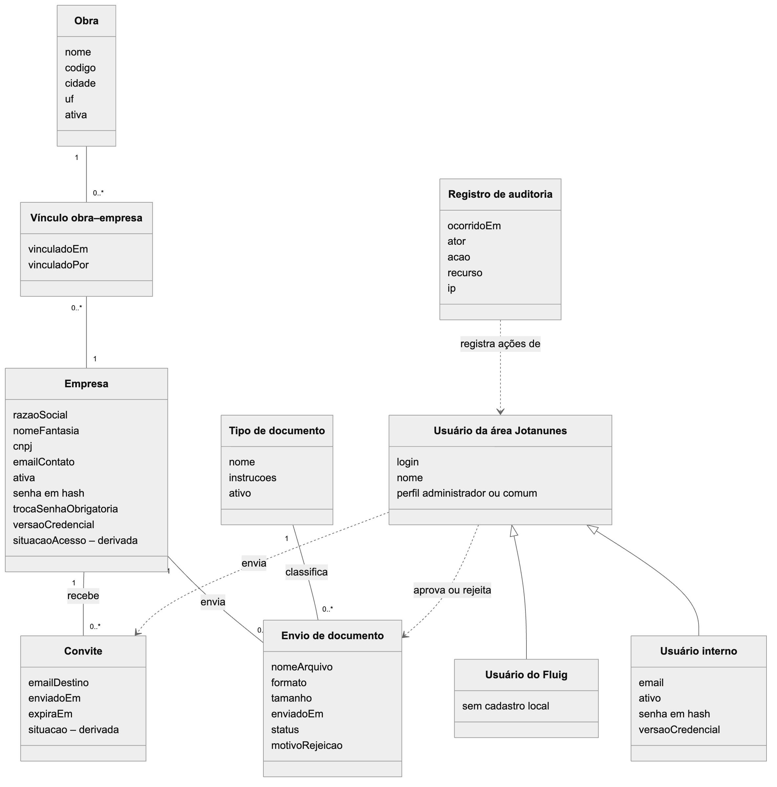
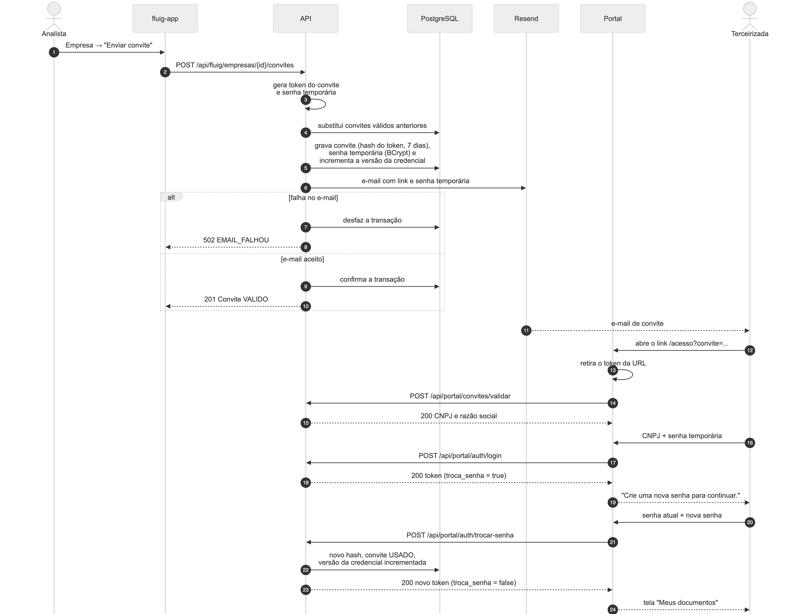
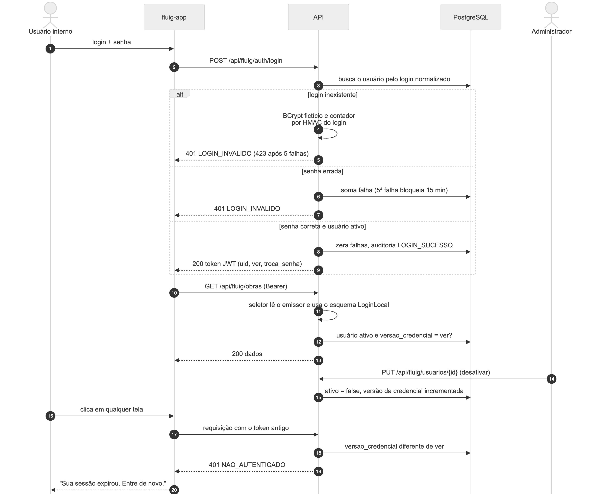
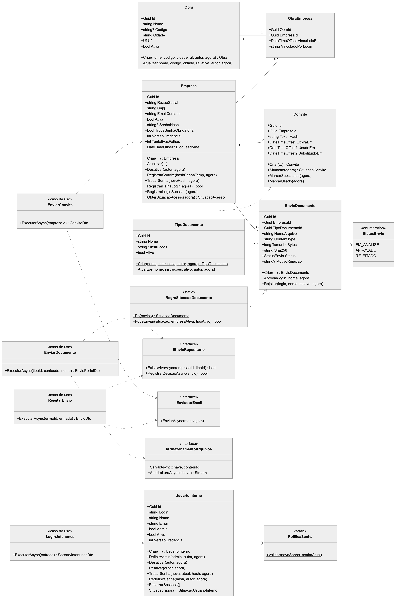
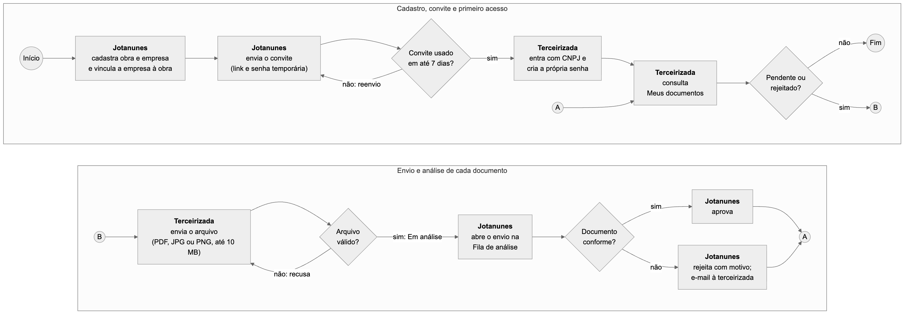
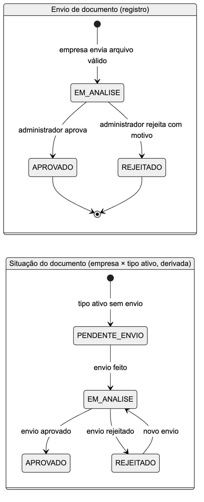
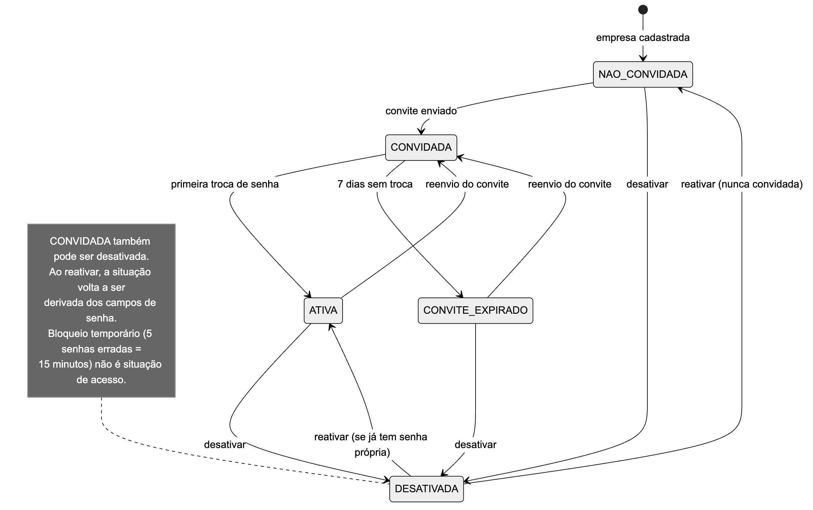
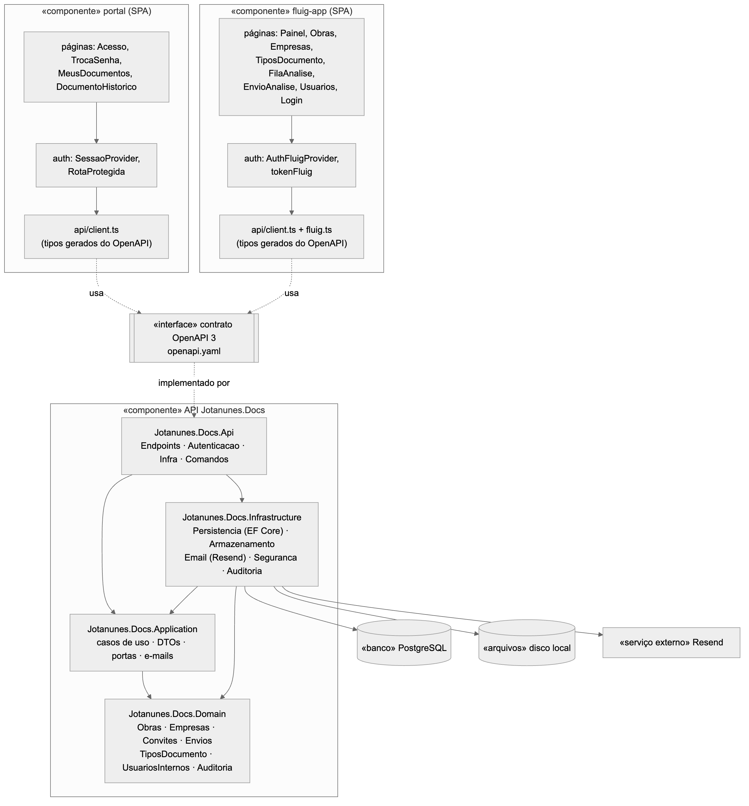

# 4. Análise e Design

Este capítulo analisa e detalha a solução do sistema de acordo com os requisitos levantados e validados no capítulo 3. São apresentadas a arquitetura do sistema e a modelagem da solução por meio de diagramas: modelo do domínio, diagramas de sequência, de classes, de atividades, de estados e de componentes, além do modelo de dados, do ambiente de desenvolvimento e dos sistemas externos utilizados.

## 4.1. Arquitetura do Sistema

O Portal de Documentação de Terceirizadas Jotanunes adota uma arquitetura **cliente/servidor em três camadas**, acessada exclusivamente pela web:

- **Camada de apresentação**: duas aplicações de página única (SPA) escritas em React e TypeScript e servidas como arquivos estáticos. O **portal da terceirizada** é usado pelas empresas prestadoras de serviço; a **área Jotanunes** (projeto `fluig-app`) é usada pelos colaboradores da Jotanunes e pode ser aberta de dentro da plataforma Fluig, que entrega a identidade do usuário em um token assinado, ou diretamente, com login próprio.
- **Camada de aplicação**: uma API REST em ASP.NET Core 8, organizada segundo a **arquitetura hexagonal** (portas e adaptadores). O núcleo (projetos `Domain` e `Application`) não conhece banco de dados, HTTP nem provedores externos; esses detalhes ficam em adaptadores (`Api`, de entrada, e `Infrastructure`, de saída) que implementam as interfaces (portas) definidas pelo núcleo.
- **Camada de dados**: banco relacional PostgreSQL 16, para os registros, e disco local do servidor, para os arquivos enviados pelas empresas (acessado por uma porta de armazenamento, trocável por um serviço de objetos no futuro).

A comunicação entre os navegadores e o servidor é feita somente por **HTTPS** (certificados Let's Encrypt), com troca de dados em JSON e autenticação por **token JWT** no cabeçalho `Authorization`. O servidor web **nginx** atua como proxy reverso da API e como servidor dos arquivos estáticos das duas SPAs. O envio de e-mails (convites, rejeições e senhas provisórias) é delegado ao serviço **Resend**. A Figura a seguir resume a arquitetura.


**Configuração de hardware, rede e software em produção.** O sistema está implantado em um servidor virtual privado (VPS) com Ubuntu 24.04 e painel CloudPanel. No mesmo servidor executam o nginx (portas 80 e 443), a API como serviço `systemd` escutando apenas no endereço local `127.0.0.1:5080`, o PostgreSQL 16 local e a pasta de arquivos enviados. Três subdomínios atendem o sistema: `protal.jotanunes.squad81.metapark.site` (portal da terceirizada), `fluig.jotanunes.squad81.metapark.site` (área Jotanunes) e `api.jotanunes.squad81.metapark.site` (API). O cliente precisa apenas de um navegador atualizado (Chrome, Edge, Firefox ou Safari) com acesso à internet; o portal funciona também em celulares.

**Dimensionamento.** Os principais limites que dimensionam o uso de recursos são:

| Item | Valor adotado |
|---|---|
| Tamanho máximo de arquivo enviado | 10 MB (10.485.760 bytes); o nginx aceita corpo de até 11 MB |
| Formatos aceitos | PDF, JPG e PNG, identificados pelo conteúdo do arquivo |
| Requisições anônimas (login e validação de convite) | 10 por minuto por endereço IP (resposta 429 acima disso) |
| Validade dos tokens | até 8 horas (portal, Fluig e login próprio) |
| Desempenho das listas | abaixo de 2 segundos com 20.000 envios na base (teste automatizado) |
| Conexões com o banco | pool padrão do Npgsql (até 100 conexões por processo) |

Como recomendação de dimensionamento mínimo para o servidor, a pilha adotada (nginx, runtime .NET 8 e PostgreSQL no mesmo host) opera com 1 vCPU e 2 GB de memória; o espaço em disco deve considerar o volume de arquivos enviados (no máximo 10 MB por envio) e as cópias de segurança do banco e da pasta de arquivos.

## 4.2. Modelo do Domínio

O modelo do domínio representa os conceitos do negócio identificados na transcrição dos requisitos e na especificação. Uma **obra** reúne várias **empresas terceirizadas** por meio de um **vínculo**; cada empresa recebe **convites** de acesso e faz **envios de documento**, cada um classificado por um **tipo de documento**. Todos os tipos de documento ativos são exigidos de todas as empresas ativas (RN01 e RN02), de modo que não há relação de exigência por empresa. Os usuários da área Jotanunes podem vir do Fluig (sem cadastro local) ou ser **usuários internos** do login próprio; ambos têm o perfil de administrador ou comum. Toda ação relevante gera um **registro de auditoria**. A situação de acesso da empresa e a situação de cada documento não são armazenadas: são derivadas dos dados.



## 4.3. Diagramas de Interação

Os diagramas de interação modelam o comportamento dinâmico do sistema, mostrando as mensagens trocadas entre atores, aplicações, API, banco de dados e serviços externos nos fluxos essenciais.

### 4.3.1. Diagrama de Sequência

**Convite e primeiro acesso da terceirizada.** O administrador envia o convite; a API gera um token aleatório de 32 bytes (guardado apenas como hash SHA-256) e uma senha temporária de 12 caracteres (guardada com BCrypt), substitui convites anteriores ainda válidos e envia o e-mail. A gravação só é confirmada se o e-mail for aceito pelo Resend; caso contrário, nada é gravado. A terceirizada abre o link, o portal retira o token do endereço e o valida por `POST`, e o primeiro login leva obrigatoriamente à troca de senha.



**Envio de documento e análise.** A terceirizada envia o arquivo; a API identifica o formato pelos primeiros bytes (não pela extensão), confere a integridade do arquivo, calcula o SHA-256 e só aceita o envio se não houver outro envio "Em análise" ou "Aprovado" para o mesmo documento. Na área Jotanunes, o administrador abre o envio pela fila e decide. A decisão é gravada por uma atualização condicional (`WHERE status = 'EM_ANALISE'`), de modo que duas decisões simultâneas resultam em uma aceita e outra recusada com `409 ENVIO_JA_ANALISADO`. Na rejeição, a empresa recebe um e-mail com o motivo; uma falha nesse e-mail não desfaz a decisão.


**Login próprio e revogação por versão da credencial.** O login próprio responde da mesma forma para login inexistente e senha errada (inclusive no tempo de resposta, com uma verificação BCrypt fictícia) e bloqueia por 15 minutos após cinco falhas seguidas. O token emitido carrega a versão da credencial do usuário (`ver`). A cada requisição a API confere se o usuário continua ativo e se a versão no banco é igual à do token; desativar, reativar, mudar o papel, redefinir a senha, trocar a senha ou sair incrementam a versão e derrubam as sessões abertas na hora.



## 4.4. Diagrama de Classes

O diagrama de classes apresenta as entidades do domínio (projeto `Jotanunes.Docs.Domain`) com seus atributos e métodos, as regras estáticas e alguns casos de uso e portas da camada de aplicação (projeto `Jotanunes.Docs.Application`). As entidades têm construtor privado e métodos de fábrica (`Criar`), de modo que um objeto só existe em estado válido; as alterações passam por métodos com nome de negócio (`Aprovar`, `Rejeitar`, `RegistrarConvite`, `TrocarSenha`, `Desativar`), que validam as regras e lançam `ErroDominio` quando violadas. Os casos de uso dependem apenas de interfaces (portas), implementadas pela infraestrutura.



Principais classes e responsabilidades:

| Classe | Camada | Responsabilidade |
|---|---|---|
| `Obra`, `ObraEmpresa` | Domain | Cadastro da obra e vínculo com as empresas |
| `Empresa` | Domain | Dados cadastrais, credencial do portal, bloqueio por tentativas e situação de acesso derivada |
| `Cnpj`, `Email`, `Uf`, `LoginUsuario` | Domain | Objetos de valor com validação (CNPJ numérico e alfanumérico com dígitos verificadores) |
| `Convite` | Domain | Convite com validade de 7 dias e situação derivada (válido, usado, expirado, substituído) |
| `TipoDocumento` | Domain | Documento exigido das empresas, com instruções |
| `EnvioDocumento` | Domain | Arquivo enviado e sua máquina de estados (em análise, aprovado, rejeitado) |
| `RegraSituacaoDocumento` | Domain | Calcula a situação de cada documento da empresa e se um novo envio é permitido |
| `PoliticaSenha` | Domain | Senha de 8 a 128 caracteres, com letras e números, diferente da atual |
| `UsuarioInterno` | Domain | Usuário do login próprio, papel, senha provisória e versão da credencial |
| `RegistroAuditoria` | Domain | Linha da trilha de auditoria (ator, ação, recurso, IP) |
| `EnviarConvite`, `LoginPortal`, `TrocarSenha`, `EnviarDocumento`, `AprovarEnvio`, `RejeitarEnvio`, `LoginJotanunes`, `CriarUsuarioInterno` e demais | Application | Casos de uso: orquestram entidades, portas, transação e auditoria |
| `IEmpresaRepositorio`, `IEnvioRepositorio`, `IUnidadeTrabalho`, `IEnviadorEmail`, `IArmazenamentoArquivos`, `IHasherSenha`, `IEmissorTokenPortal` e demais | Application | Portas (interfaces) implementadas pela infraestrutura |

## 4.5. Diagrama de Atividades

O diagrama de atividades detalha o fluxo de trabalho de documentação de uma empresa terceirizada, que é o processo central do sistema e envolve dois atores em momentos diferentes: a Jotanunes (cadastro, convite e análise) e a terceirizada (primeiro acesso e envio). Os conectores "A" e "B" ligam as duas partes do fluxo.



## 4.6. Diagrama de Estados

Dois objetos do sistema têm ciclo de vida relevante. O primeiro é o **envio de documento**: cada registro nasce "Em análise" e termina "Aprovado" ou "Rejeitado", estados finais e imutáveis. A partir dos envios, calcula-se a **situação do documento** para cada par empresa × tipo ativo: "Pendente de envio" enquanto não houver envio, e, depois, a situação do envio mais recente não rejeitado ou, não havendo, "Rejeitado" (com o motivo). Um documento rejeitado volta a "Em análise" com um **novo** envio; o registro rejeitado é preservado no histórico.



O segundo é a **situação de acesso da empresa** ao portal, também derivada dos dados (não persistida): "Não convidada" até o primeiro convite; "Convidada" enquanto a senha temporária estiver válida; "Convite expirado" após 7 dias sem a troca de senha; "Ativa" depois da primeira troca; e "Desativada" quando a empresa é desativada. O bloqueio temporário após cinco senhas erradas não é uma situação de acesso: é informado à parte, com o horário de liberação.



O usuário interno do login próprio segue ciclo análogo, com as situações "Aguardando primeiro acesso", "Senha provisória expirada", "Ativo" e "Desativado".

## 4.7. Diagrama de Componentes

O diagrama de componentes apresenta a organização física do código e as dependências entre as partes. As duas SPAs dependem do **contrato OpenAPI** (`specs/001-portal-documentos-terceirizadas/contracts/openapi.yaml`, 43 operações), do qual os tipos TypeScript são gerados automaticamente (`npm run gen:api`). A API implementa o mesmo contrato, e um teste automatizado confere que as rotas, os nomes das operações, os enumerados e os esquemas da API são exatamente os do contrato. Na API, as dependências apontam sempre para o núcleo: `Api` e `Infrastructure` dependem de `Application` e `Domain`; `Domain` não depende de nenhum outro projeto (regra também verificada por teste de arquitetura).



## 4.8. Modelo de Dados

### 4.8.1. Modelo Lógico da Base de Dados

O modelo lógico foi derivado do diagrama de classes e mapeado pelo Entity Framework Core com a convenção de nomes em minúsculas separadas por sublinhado (*snake_case*). Todas as tabelas estão na terceira forma normal: as chaves primárias são identificadores `uuid` gerados pela aplicação (exceto `auditoria`, com chave numérica sequencial, e `tentativas_login`, cuja chave é um HMAC); a relação N:N entre obras e empresas é resolvida pela tabela associativa `obra_empresas`; os atributos derivados (situação de acesso, situação do convite, situação do documento) não são armazenados. As colunas de autoria guardam o login de quem executou a ação, sem chave estrangeira, porque o usuário pode vir do Fluig, onde não há cadastro local. Datas são gravadas em UTC (`timestamptz`).


Regras de integridade garantidas pelo próprio banco:

- CNPJ único (`ix_empresas_cnpj`), código de obra único sem diferenciar maiúsculas (`ix_obras_codigo_upper`, parcial, só quando preenchido), nome de tipo de documento único sem diferenciar maiúsculas (`ix_tipos_documento_nome_lower`) e login de usuário interno único (`ix_usuarios_internos_login_lower`).
- Hash de token de convite único (`ix_convites_token_hash`).
- **Um único envio "vivo" por empresa e tipo de documento**: índice único parcial `ix_envios_documento_vivo` sobre `(empresa_id, tipo_documento_id)` com `WHERE status <> 'REJEITADO'` (RN12). Mesmo com dois envios simultâneos, apenas um é aceito.
- Chaves estrangeiras com `ON DELETE RESTRICT`: nenhum registro com dependentes pode ser apagado, coerente com a regra de que nada é excluído pela interface (RN23).

### 4.8.2. Criação Física do Modelo de Dados

O banco é criado pelas *migrations* do Entity Framework Core (`Inicial`, `TentativasLoginPorCnpj`, `PerfilAdminAuditoria` e `UsuariosInternos`), aplicadas automaticamente na subida da API quando `Database:MigrateOnStartup=true`. O script SQL completo foi gerado com o comando `dotnet ef migrations script` e está no repositório em `docs/documentacao/ddl-completo.sql`. A seguir, um trecho representativo com as tabelas principais e os índices únicos e parciais relevantes.

```sql
CREATE EXTENSION IF NOT EXISTS unaccent;

CREATE TABLE empresas (
    id uuid NOT NULL,
    razao_social character varying(200) NOT NULL,
    nome_fantasia character varying(200),
    cnpj char(14) NOT NULL,
    email_contato character varying(254) NOT NULL,
    nome_contato character varying(150),
    telefone character varying(20),
    ativa boolean NOT NULL,
    senha_hash character varying(100),
    troca_senha_obrigatoria boolean NOT NULL,
    senha_temporaria_expira_em timestamp with time zone,
    versao_credencial integer NOT NULL,
    tentativas_falhas integer NOT NULL,
    bloqueado_ate timestamp with time zone,
    ultimo_acesso_em timestamp with time zone,
    criado_em timestamp with time zone NOT NULL,
    criado_por_login character varying(100) NOT NULL,
    atualizado_em timestamp with time zone,
    atualizado_por_login character varying(100),
    CONSTRAINT pk_empresas PRIMARY KEY (id)
);

CREATE TABLE convites (
    id uuid NOT NULL,
    empresa_id uuid NOT NULL,
    email_destino character varying(254) NOT NULL,
    token_hash char(64) NOT NULL,
    enviado_em timestamp with time zone NOT NULL,
    enviado_por_login character varying(100) NOT NULL,
    enviado_por_nome character varying(150) NOT NULL,
    expira_em timestamp with time zone NOT NULL,
    usado_em timestamp with time zone,
    substituido_em timestamp with time zone,
    CONSTRAINT pk_convites PRIMARY KEY (id),
    CONSTRAINT fk_convites_empresas_empresa_id FOREIGN KEY (empresa_id)
        REFERENCES empresas (id) ON DELETE RESTRICT
);

CREATE TABLE obra_empresas (
    obra_id uuid NOT NULL,
    empresa_id uuid NOT NULL,
    vinculado_em timestamp with time zone NOT NULL,
    vinculado_por_login character varying(100) NOT NULL,
    CONSTRAINT pk_obra_empresas PRIMARY KEY (obra_id, empresa_id),
    CONSTRAINT fk_obra_empresas_empresas_empresa_id FOREIGN KEY (empresa_id)
        REFERENCES empresas (id) ON DELETE RESTRICT,
    CONSTRAINT fk_obra_empresas_obras_obra_id FOREIGN KEY (obra_id)
        REFERENCES obras (id) ON DELETE RESTRICT
);

CREATE TABLE envios_documento (
    id uuid NOT NULL,
    empresa_id uuid NOT NULL,
    tipo_documento_id uuid NOT NULL,
    nome_arquivo character varying(255) NOT NULL,
    content_type character varying(50) NOT NULL,
    tamanho_bytes bigint NOT NULL,
    sha256 char(64) NOT NULL,
    chave_armazenamento character varying(300) NOT NULL,
    enviado_em timestamp with time zone NOT NULL,
    status character varying(20) NOT NULL,
    analisado_em timestamp with time zone,
    analisado_por_login character varying(100),
    analisado_por_nome character varying(150),
    motivo_rejeicao character varying(500),
    CONSTRAINT pk_envios_documento PRIMARY KEY (id),
    CONSTRAINT fk_envios_documento_empresas_empresa_id FOREIGN KEY (empresa_id)
        REFERENCES empresas (id) ON DELETE RESTRICT,
    CONSTRAINT fk_envios_documento_tipos_documento_tipo_documento_id
        FOREIGN KEY (tipo_documento_id) REFERENCES tipos_documento (id) ON DELETE RESTRICT
);

CREATE UNIQUE INDEX ix_empresas_cnpj ON empresas (cnpj);
CREATE UNIQUE INDEX ix_convites_token_hash ON convites (token_hash);
CREATE UNIQUE INDEX ix_obras_codigo_upper ON obras (upper(codigo)) WHERE codigo IS NOT NULL;
CREATE UNIQUE INDEX ix_tipos_documento_nome_lower ON tipos_documento (lower(nome));
CREATE INDEX ix_envios_documento_status_enviado ON envios_documento (status, enviado_em);
CREATE INDEX ix_envios_documento_empresa_tipo_enviado
    ON envios_documento (empresa_id, tipo_documento_id, enviado_em DESC);
CREATE UNIQUE INDEX ix_envios_documento_vivo ON envios_documento (empresa_id, tipo_documento_id)
    WHERE status <> 'REJEITADO';

CREATE TABLE usuarios_internos (
    id uuid NOT NULL,
    login character varying(100) NOT NULL,
    nome character varying(150) NOT NULL,
    email character varying(254) NOT NULL,
    admin boolean NOT NULL,
    ativo boolean NOT NULL,
    senha_hash character varying(100) NOT NULL,
    troca_senha_obrigatoria boolean NOT NULL,
    senha_provisoria_expira_em timestamp with time zone,
    versao_credencial integer NOT NULL,
    tentativas_falhas integer NOT NULL,
    bloqueado_ate timestamp with time zone,
    ultimo_acesso_em timestamp with time zone,
    criado_em timestamp with time zone NOT NULL,
    criado_por_login character varying(100) NOT NULL,
    atualizado_em timestamp with time zone,
    atualizado_por_login character varying(100),
    CONSTRAINT pk_usuarios_internos PRIMARY KEY (id)
);

CREATE UNIQUE INDEX ix_usuarios_internos_login_lower ON usuarios_internos (lower(login));
CREATE INDEX ix_usuarios_internos_admin_ativo ON usuarios_internos (admin, ativo)
    WHERE admin AND ativo;
```

O sistema não utiliza *stored procedures*: as regras de negócio ficam no domínio da aplicação, e o acesso a dados é feito pelo Entity Framework Core com consultas parametrizadas. O banco garante as restrições de unicidade e integridade referencial listadas acima.

### 4.8.3. Dicionário de Dados

A seguir, o dicionário de dados de todas as tabelas do banco `jotanunes_docs`. Além delas, o Entity Framework Core mantém a tabela técnica `__EFMigrationsHistory` (colunas `migration_id` e `product_version`), que registra as *migrations* aplicadas.

#### Tabela obras

| Coluna | Tipo | Nulo | Descrição |
|---|---|---|---|
| id | uuid | Não | Chave primária, gerada pela aplicação |
| nome | varchar(150) | Não | Nome da obra (3 a 150 caracteres) |
| codigo | varchar(30) | Sim | Código interno opcional; único sem diferenciar maiúsculas quando preenchido |
| cidade | varchar(100) | Não | Cidade da obra |
| uf | char(2) | Não | Unidade da Federação (uma das 27 siglas) |
| ativa | boolean | Não | Indica se a obra está ativa (padrão verdadeiro) |
| criado_em | timestamptz | Não | Data e hora do cadastro (UTC) |
| criado_por_login | varchar(100) | Não | Login de quem cadastrou |
| atualizado_em | timestamptz | Sim | Data e hora da última alteração |
| atualizado_por_login | varchar(100) | Sim | Login de quem alterou por último |

#### Tabela empresas

| Coluna | Tipo | Nulo | Descrição |
|---|---|---|---|
| id | uuid | Não | Chave primária |
| razao_social | varchar(200) | Não | Razão social (2 a 200 caracteres) |
| nome_fantasia | varchar(200) | Sim | Nome fantasia |
| cnpj | char(14) | Não | CNPJ normalizado, sem máscara (numérico ou alfanumérico); único; imutável após o primeiro convite |
| email_contato | varchar(254) | Não | E-mail que recebe convites e avisos de rejeição (minúsculas) |
| nome_contato | varchar(150) | Sim | Nome da pessoa de contato |
| telefone | varchar(20) | Sim | Telefone, só dígitos (10 ou 11) |
| ativa | boolean | Não | Indica se a empresa está ativa |
| senha_hash | varchar(100) | Sim | Hash BCrypt da senha do portal; nulo até o primeiro convite |
| troca_senha_obrigatoria | boolean | Não | Verdadeiro após cada convite, até a empresa criar a própria senha |
| senha_temporaria_expira_em | timestamptz | Sim | Expiração da senha temporária do convite vigente |
| versao_credencial | integer | Não | Versão da credencial; incrementada em convite, troca de senha e desativação (revoga tokens) |
| tentativas_falhas | integer | Não | Falhas de login seguidas |
| bloqueado_ate | timestamptz | Sim | Fim do bloqueio temporário (15 minutos após 5 falhas) |
| ultimo_acesso_em | timestamptz | Sim | Último login com sucesso |
| criado_em | timestamptz | Não | Data e hora do cadastro |
| criado_por_login | varchar(100) | Não | Login de quem cadastrou |
| atualizado_em | timestamptz | Sim | Data e hora da última alteração |
| atualizado_por_login | varchar(100) | Sim | Login de quem alterou por último |

#### Tabela obra_empresas

| Coluna | Tipo | Nulo | Descrição |
|---|---|---|---|
| obra_id | uuid | Não | Parte da chave primária; chave estrangeira para `obras` |
| empresa_id | uuid | Não | Parte da chave primária; chave estrangeira para `empresas` |
| vinculado_em | timestamptz | Não | Data e hora do vínculo |
| vinculado_por_login | varchar(100) | Não | Login de quem vinculou |

#### Tabela tipos_documento

| Coluna | Tipo | Nulo | Descrição |
|---|---|---|---|
| id | uuid | Não | Chave primária |
| nome | varchar(120) | Não | Nome do documento exigido (3 a 120 caracteres); único sem diferenciar maiúsculas |
| instrucoes | varchar(1000) | Sim | Orientação exibida para a empresa |
| ativo | boolean | Não | Tipo ativo é exigido de todas as empresas ativas |
| criado_em | timestamptz | Não | Data e hora do cadastro |
| criado_por_login | varchar(100) | Não | Login de quem cadastrou (`sistema` no catálogo padrão) |
| atualizado_em | timestamptz | Sim | Data e hora da última alteração |
| atualizado_por_login | varchar(100) | Sim | Login de quem alterou por último |

#### Tabela convites

| Coluna | Tipo | Nulo | Descrição |
|---|---|---|---|
| id | uuid | Não | Chave primária |
| empresa_id | uuid | Não | Chave estrangeira para `empresas` |
| email_destino | varchar(254) | Não | Cópia do e-mail para o qual o convite foi enviado |
| token_hash | char(64) | Não | Hash SHA-256 (hexadecimal) do token do link; o token não é guardado; único |
| enviado_em | timestamptz | Não | Data e hora do envio |
| enviado_por_login | varchar(100) | Não | Login de quem enviou |
| enviado_por_nome | varchar(150) | Não | Nome de quem enviou |
| expira_em | timestamptz | Não | Envio + 7 dias |
| usado_em | timestamptz | Sim | Preenchido na primeira troca de senha |
| substituido_em | timestamptz | Sim | Preenchido quando um novo convite é enviado |

#### Tabela envios_documento

| Coluna | Tipo | Nulo | Descrição |
|---|---|---|---|
| id | uuid | Não | Chave primária |
| empresa_id | uuid | Não | Chave estrangeira para `empresas` |
| tipo_documento_id | uuid | Não | Chave estrangeira para `tipos_documento` |
| nome_arquivo | varchar(255) | Não | Nome original do arquivo, saneado (sem caminho nem caracteres de controle) |
| content_type | varchar(50) | Não | Formato detectado pelo conteúdo: `application/pdf`, `image/jpeg` ou `image/png` |
| tamanho_bytes | bigint | Não | Tamanho do arquivo (1 a 10.485.760 bytes) |
| sha256 | char(64) | Não | Hash SHA-256 do conteúdo, para integridade |
| chave_armazenamento | varchar(300) | Não | Caminho interno do arquivo (`empresas/{empresa}/{envio}`); nunca exposto pela API |
| enviado_em | timestamptz | Não | Data e hora do envio |
| status | varchar(20) | Não | `EM_ANALISE`, `APROVADO` ou `REJEITADO` |
| analisado_em | timestamptz | Sim | Data e hora da decisão |
| analisado_por_login | varchar(100) | Sim | Login de quem decidiu |
| analisado_por_nome | varchar(150) | Sim | Nome de quem decidiu (não exibido para a empresa) |
| motivo_rejeicao | varchar(500) | Sim | Motivo da rejeição (5 a 500 caracteres); obrigatório somente se rejeitado |

#### Tabela usuarios_internos

| Coluna | Tipo | Nulo | Descrição |
|---|---|---|---|
| id | uuid | Não | Chave primária |
| login | varchar(100) | Não | Login em minúsculas (letras sem acento, números, ponto, hífen, sublinhado); único e imutável |
| nome | varchar(150) | Não | Nome do colaborador |
| email | varchar(254) | Não | E-mail que recebe a senha provisória |
| admin | boolean | Não | Verdadeiro para perfil administrador |
| ativo | boolean | Não | Indica se o usuário pode entrar |
| senha_hash | varchar(100) | Não | Hash BCrypt (custo 12) da senha |
| troca_senha_obrigatoria | boolean | Não | Verdadeiro na criação e a cada redefinição, até a troca |
| senha_provisoria_expira_em | timestamptz | Sim | Criação ou redefinição + 7 dias |
| versao_credencial | integer | Não | Incrementada ao desativar, reativar, redefinir ou trocar senha, mudar o papel e sair |
| tentativas_falhas | integer | Não | Falhas de login seguidas |
| bloqueado_ate | timestamptz | Sim | Fim do bloqueio temporário |
| ultimo_acesso_em | timestamptz | Sim | Último login com sucesso |
| criado_em | timestamptz | Não | Data e hora do cadastro |
| criado_por_login | varchar(100) | Não | Login de quem cadastrou ou `sistema` (comando de instalação) |
| atualizado_em | timestamptz | Sim | Data e hora da última alteração |
| atualizado_por_login | varchar(100) | Sim | Login de quem alterou por último |

#### Tabela auditoria

| Coluna | Tipo | Nulo | Descrição |
|---|---|---|---|
| id | bigint (identity) | Não | Chave primária sequencial |
| ocorrido_em | timestamptz | Não | Data e hora do evento |
| ator_tipo | varchar(10) | Não | `FLUIG`, `LOCAL`, `EMPRESA`, `ANONIMO` ou `SISTEMA` |
| ator_id | varchar(100) | Sim | Login, id da empresa, CNPJ ou login informado em tentativa de acesso |
| ator_admin | boolean | Sim | Perfil do usuário da área Jotanunes no momento da ação; nulo para os demais atores |
| acao | varchar(40) | Não | Ação registrada (ex.: `LOGIN_SUCESSO`, `CONVITE_ENVIADO`, `ENVIO_REJEITADO`, `PERMISSAO_NEGADA`, `USUARIO_CRIADO`) |
| recurso_tipo | varchar(40) | Sim | Tipo do recurso afetado (ex.: `EMPRESA`, `ENVIO`, `USUARIO_INTERNO`, `OPERACAO`) |
| recurso_id | varchar(100) | Sim | Identificador do recurso afetado |
| ip | varchar(45) | Sim | Endereço IP de origem (IPv4 ou IPv6) |

#### Tabela tentativas_login

| Coluna | Tipo | Nulo | Descrição |
|---|---|---|---|
| chave | char(64) | Não | Chave primária: HMAC-SHA256 do CNPJ ou do login digitado que não corresponde a um cadastro (o valor digitado não é guardado) |
| tentativas_falhas | integer | Não | Falhas seguidas desde o último bloqueio |
| bloqueado_ate | timestamptz | Sim | Fim do bloqueio (15 minutos após 5 falhas) |
| ultima_falha_em | timestamptz | Sim | Data e hora da última falha |

## 4.9. Ambiente de Desenvolvimento

O desenvolvimento foi conduzido com as seguintes linguagens, frameworks, bibliotecas e ferramentas (versões conforme os arquivos de projeto `*.csproj` e `package.json`):

| Categoria | Tecnologia | Versão |
|---|---|---|
| Linguagem do backend | C# | 12 (alvo `net8.0`) |
| Plataforma do backend | .NET SDK / ASP.NET Core (Minimal APIs) | 8 (SDK 8.0.4xx) |
| Acesso a dados | Entity Framework Core + Npgsql.EntityFrameworkCore.PostgreSQL | 8.0.11 |
| Convenção de nomes do banco | EFCore.NamingConventions | 8.0.3 |
| Autenticação | Microsoft.AspNetCore.Authentication.JwtBearer | 8.0.11 |
| Hash de senhas | BCrypt.Net-Next | 4.0.3 |
| Banco de dados | PostgreSQL | 16 |
| Testes do backend | xUnit, Microsoft.AspNetCore.Mvc.Testing, Testcontainers.PostgreSql, Microsoft.OpenApi.Readers | 2.5.3; 8.0.11; 4.15.0; 1.6.22 |
| Linguagem dos fronts | TypeScript | 5.6 (fluig-app) e 5.9 (portal) |
| Biblioteca de interface | React e React DOM | 18.3 |
| Roteamento | React Router | 6.30 |
| Empacotador | Vite | 5.4 |
| Testes dos fronts | Vitest, Testing Library, jsdom, MSW (mocks do contrato) | 2.1; 16.3; 25; 2.15 |
| Geração de tipos da API | openapi-typescript | 7.13 |
| Qualidade de código | ESLint com typescript-eslint | 9.39 |
| Contrato da API | OpenAPI 3 (`contracts/openapi.yaml`) | 1.2.0 |
| Estilos | CSS puro com variáveis (sem framework de CSS), identidade visual da Jotanunes | — |
| Contêineres (desenvolvimento e testes) | Docker e Docker Compose (imagem `postgres:16-alpine`) | — |
| Controle de versão | Git | — |
| Processo de especificação | GitHub Spec Kit (constituição, especificação, clarificação, plano, tarefas, análise, implementação e convergência) | — |
| Assistente de desenvolvimento | Claude Code (Anthropic), com agentes de IA em paralelo por área | — |
| Navegador de testes manuais e capturas | Google Chrome e Playwright | — |

**Organização do repositório.** O repositório tem as pastas `backend/` (solução .NET com os projetos `Domain`, `Application`, `Infrastructure`, `Api` e três projetos de testes), `fluig-app/` (área Jotanunes), `portal/` (portal da terceirizada), `specs/` (especificação, plano, modelo de dados, contratos e tarefas), `deploy/` (scripts de publicação) e `docs/` (insumos e esta documentação).

**Ambiente local.** O banco é executado em contêiner com `docker compose up -d`; a API com `dotnet run` na porta 5080; o `fluig-app` na porta 5173 e o portal na porta 5174 com `npm run dev`. Em desenvolvimento, os e-mails são registrados no log da API em vez de enviados, e um script (`scripts/gerar-token-fluig-dev.mjs`) gera tokens do Fluig de teste com perfil administrador ou comum. Os fronts também podem ser executados sem backend, com os mocks do contrato (MSW).

**Hardware e rede.** O desenvolvimento foi feito em estações macOS com acesso à internet; os testes de integração exigem o Docker em execução, pois cada execução sobe um PostgreSQL descartável.

## 4.10. Sistemas e Componentes Externos Utilizados

| Sistema ou componente | Uso no sistema |
|---|---|
| **Fluig (TOTVS)** | Plataforma de processos da Jotanunes. A área Jotanunes foi desenhada para ser aberta de dentro do Fluig, que entrega a identidade do usuário (login, nome, e-mail e papel `admin`) em um token JWT assinado (HS256, validade máxima de 8 horas) no fragmento do endereço (`#fluigToken=`). O contrato dessa integração está em `contracts/fluig-identity.md`; a configuração do lado do Fluig é uma etapa futura, e até lá a área Jotanunes é usada com o login próprio. |
| **Resend** | Serviço de envio de e-mails transacionais, acessado por API HTTPS (`POST https://api.resend.com/emails`). Envia o convite (link e senha temporária), o aviso de rejeição (com o motivo) e a senha provisória dos usuários internos, com o logotipo da Jotanunes anexado em linha. Remetente: `nao-responda@metapark.site`. |
| **PostgreSQL 16** | Banco de dados relacional de código aberto, com a extensão `unaccent` para buscas sem acento. |
| **nginx** | Servidor web e proxy reverso: termina o HTTPS, serve os arquivos estáticos do portal e da área Jotanunes e encaminha as chamadas da API para `127.0.0.1:5080`, repassando os cabeçalhos `X-Forwarded-For` e `X-Forwarded-Proto`. |
| **Let's Encrypt / Certbot** | Emissão e renovação automática dos certificados TLS dos três subdomínios. |
| **systemd** | Gerenciador de serviços do Ubuntu: mantém a API em execução (`jotanunes-docs-api`), reinicia em caso de falha e aplica restrições de segurança ao processo. |
| **CloudPanel** | Painel de administração já existente na VPS; o sistema foi instalado de forma nativa, sem alterar a configuração do painel. |
| **Bibliotecas de código aberto** | BCrypt.Net-Next (hash de senhas), Npgsql e Entity Framework Core (acesso a dados), React, React Router e Vite (interfaces), MSW (simulação da API nos testes dos fronts), Testcontainers (banco descartável nos testes). |
