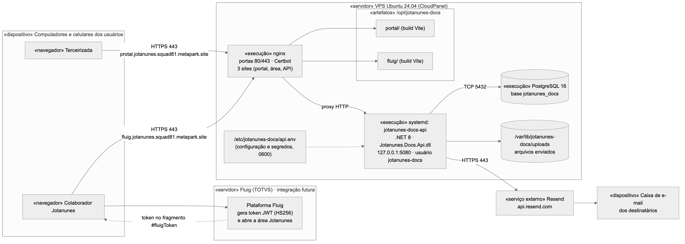

# 7. Implantação

Este capítulo apresenta as informações necessárias para a implantação e o funcionamento do sistema em produção: a disposição física dos componentes e o procedimento de instalação e atualização.

## 7.1. Diagrama de Implantação

O sistema é implantado em um único servidor virtual (VPS) com Ubuntu 24.04 e CloudPanel. A instalação é **nativa** (sem contêineres em produção) e não altera a configuração do painel. No servidor executam:

- **nginx**, nas portas 80 e 443, com certificados emitidos pelo Certbot (Let's Encrypt), atendendo três sites: o portal da terceirizada, a área Jotanunes e a API;
- os **arquivos estáticos** do portal e da área Jotanunes, em `/opt/jotanunes-docs/portal` e `/opt/jotanunes-docs/fluig`;
- a **API**, como serviço `systemd` `jotanunes-docs-api`, executando o runtime .NET 8 com o usuário de sistema `jotanunes-docs`, escutando somente em `127.0.0.1:5080`, com arquivos em `/opt/jotanunes-docs/api`;
- o **PostgreSQL 16** local, com base e usuário `jotanunes_docs`;
- a pasta de **arquivos enviados**, `/var/lib/jotanunes-docs/uploads`;
- a **configuração e os segredos**, em `/etc/jotanunes-docs/api.env` (permissão 0600, dono root).

Fora do servidor ficam os navegadores dos usuários, o serviço de e-mail Resend e, como integração futura, a plataforma Fluig, que abrirá a área Jotanunes entregando o token do usuário.



Endereços de produção:

| Parte | Endereço |
|---|---|
| Portal da terceirizada | https://protal.jotanunes.squad81.metapark.site |
| Área Jotanunes (Fluig ou login próprio) | https://fluig.jotanunes.squad81.metapark.site |
| API | https://api.jotanunes.squad81.metapark.site |

## 7.2. Manual de Implantação

O procedimento abaixo é automatizado pelos scripts da pasta `deploy/` do repositório: `publicar.sh` (executado na máquina de quem publica), `instalar.sh` (executado no servidor, idempotente) e `criar-admin.sh` (atalho para criar o primeiro administrador). Nenhum segredo faz parte do repositório.

#### Pré-requisitos

1. Servidor Ubuntu 24.04 com acesso de administrador por SSH com chave, nginx, Certbot, PostgreSQL 16 e runtime do ASP.NET Core 8 instalados.
2. Registros DNS dos três subdomínios apontando para o servidor.
3. Na máquina de publicação: .NET SDK 8, Node.js 22 com npm, o repositório clonado e as dependências dos fronts instaladas (`npm ci` em `fluig-app/` e `portal/`).
4. Conta no Resend com o domínio remetente verificado e uma chave de API.
5. Arquivo `producao.env` na raiz do repositório (ignorado pelo Git) com a senha do banco (`DB_SENHA`) e os três segredos de assinatura de tokens: `FLUIG_JWT_SECRET` (compartilhado com o Fluig), `AUTH_PORTAL_SECRET` e `AUTH_LOGIN_LOCAL_SECRET`, cada um com pelo menos 32 bytes e diferentes entre si. Um segredo pode ser gerado com `openssl rand -base64 48`.
6. Arquivo `.env` com `RESEND_API_KEY` e `RESEND_FROM` (remetente entre aspas, por exemplo `"Jotanunes <nao-responda@dominio>"`).

#### Publicar uma versão

1. Na raiz do repositório, executar:

```bash
./deploy/publicar.sh
```

2. O script executa, na ordem:
   - confere se todos os segredos existem, se o segredo do login próprio tem ao menos 32 bytes e se é diferente dos outros dois; se algo faltar, para com mensagem clara;
   - compila a API em modo *Release* (`dotnet publish`) e remove o arquivo de configuração de desenvolvimento do pacote;
   - gera os *builds* de produção do `fluig-app` e do portal com o endereço da API (`VITE_API_URL`) e sem mocks, removendo o *service worker* de simulação;
   - monta o arquivo `api.env` com a configuração de produção (conexão com o banco, segredos, remetente do Resend, endereços do portal e da área Jotanunes, pasta de arquivos, origens permitidas no CORS, aplicação automática das *migrations* e criação do catálogo padrão de tipos de documento);
   - empacota tudo, copia para o servidor por SSH e executa o `instalar.sh`;
   - aguarda a API responder em `/health` por até 60 segundos e informa "API no ar — publicado.".

3. No servidor, o `instalar.sh`:
   - cria o usuário de sistema `jotanunes-docs` e as pastas de dados;
   - instala o `api.env` em `/etc/jotanunes-docs/` com permissão 0600;
   - cria (se necessário) o usuário e a base `jotanunes_docs` no PostgreSQL, atualiza a senha e habilita a extensão `unaccent`;
   - substitui as pastas da API e dos fronts de forma atômica, guardando a versão anterior em `*.antigo`;
   - cria a unidade `systemd` `jotanunes-docs-api` (reinício automático, `NoNewPrivileges`, `ProtectSystem=strict`, `ProtectHome`, `PrivateTmp` e escrita somente na pasta de dados), habilita e reinicia o serviço;
   - instala o atalho `/usr/local/sbin/jotanunes-docs-criar-admin`;
   - na primeira instalação, cria a configuração do nginx para os três sites (API como proxy para `127.0.0.1:5080` com limite de corpo de 11 MB; fronts com cache longo para `/assets/` e `no-cache` para o `index.html`); nas seguintes, preserva o arquivo já ajustado pelo Certbot;
   - valida e recarrega o nginx e avisa se ainda não existe administrador do login próprio.

4. Ao subir, a API valida a configuração (recusa segredos curtos ou repetidos e a falta das configurações de e-mail), aplica as *migrations* pendentes e cria os 10 tipos de documento padrão se a tabela estiver vazia.

#### Certificados HTTPS (primeira instalação)

Após a primeira publicação, emitir os certificados com o Certbot para os três subdomínios (por exemplo, `certbot --nginx -d protal.jotanunes.squad81.metapark.site -d fluig.jotanunes.squad81.metapark.site -d api.jotanunes.squad81.metapark.site`). O Certbot acrescenta o HTTPS ao arquivo do nginx e agenda a renovação automática.

#### Primeiro administrador

No servidor, após a publicação, criar o primeiro administrador do login próprio da área Jotanunes (o comando nunca é executado automaticamente):

```bash
jotanunes-docs-criar-admin --login ana.souza --nome "Ana Souza" --email ana.souza@exemplo.com.br
```

O comando usa o mesmo ambiente do serviço, sem subir outro servidor web. A senha provisória (válida por 7 dias, com troca obrigatória no primeiro acesso) aparece **somente no terminal** e é enviada também por e-mail. Códigos de saída: `0` concluído, `1` uso inválido ou login próprio desligado, `2` já existe administrador ativo. Se todos os administradores perderem o acesso, o mesmo comando com `--forcar` recupera o acesso do login informado.

#### Operação

- Situação do serviço: `systemctl status jotanunes-docs-api`.
- Logs (em JSON, sem senhas nem tokens): `journalctl -u jotanunes-docs-api -n 100 --no-pager`.
- Desligar o login próprio (entrada somente pelo Fluig): definir `Auth__LoginLocal__Habilitado=false` em `/etc/jotanunes-docs/api.env` e executar `systemctl restart jotanunes-docs-api`.
- Trocar o segredo do login próprio derruba todas as sessões desse tipo; senhas e usuários não mudam.
- Cópias de segurança: incluir a base `jotanunes_docs` (por exemplo, com `pg_dump`) e a pasta `/var/lib/jotanunes-docs/uploads`, que devem ser salvas juntas.

#### Integração com o Fluig

Para abrir a área Jotanunes de dentro do Fluig, o Fluig deve gerar, para o usuário logado, um token JWT assinado com o `FLUIG_JWT_SECRET` (HS256, emissor `fluig`, audiência `jotanunes-docs-api`, validade máxima de 8 horas, com `sub`, `name`, `email` e, para administradores, `roles: ["admin"]`) e abrir `https://fluig.jotanunes.squad81.metapark.site/#fluigToken=<token>`. O formato completo está em `specs/001-portal-documentos-terceirizadas/contracts/fluig-identity.md`.
