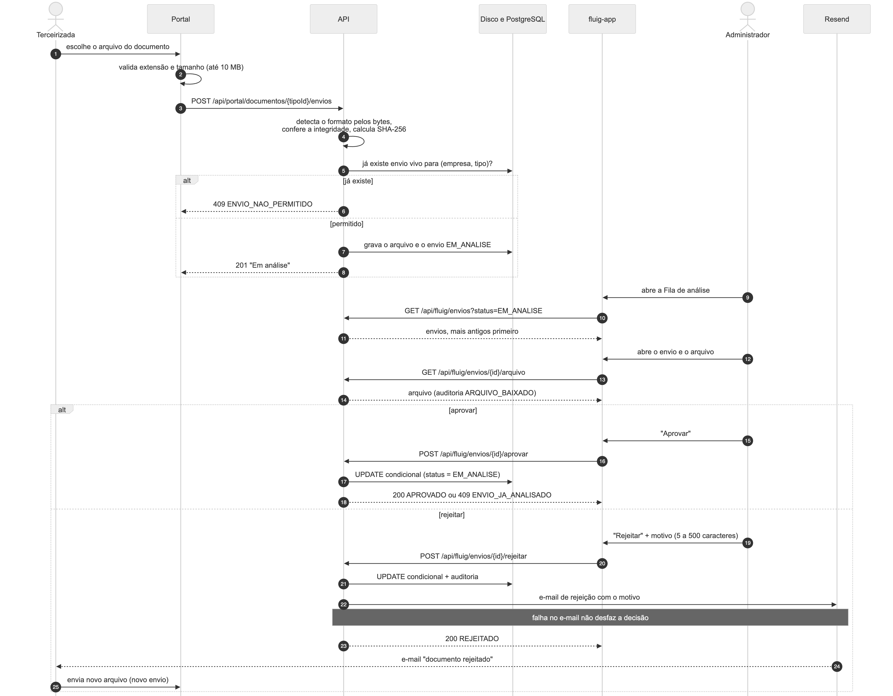
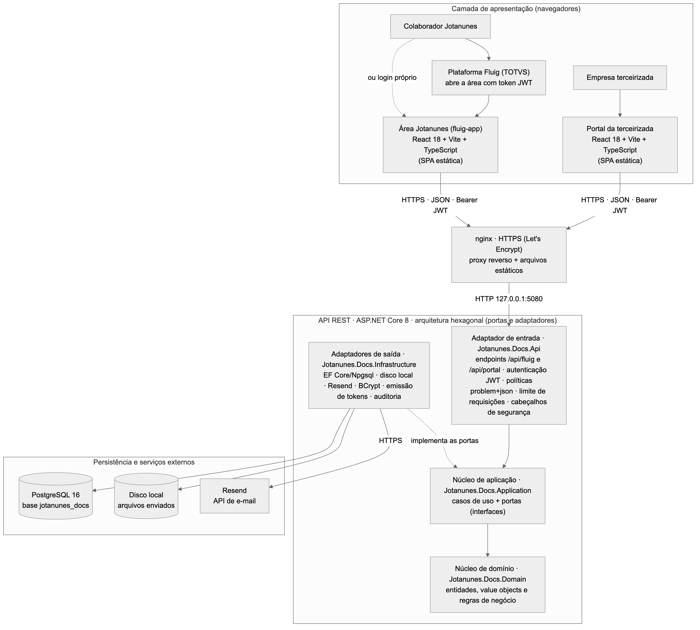

<!-- ANCORA: 3.1 -->

O banco de dados é um **PostgreSQL 16** (base `jotanunes_docs`), criado e versionado pelas *migrations* do Entity Framework Core (`Inicial`, `TentativasLoginPorCnpj`, `PerfilAdminAuditoria` e `UsuariosInternos`), aplicadas automaticamente na subida da API. As tabelas e colunas seguem a convenção *snake_case*; as chaves primárias são `uuid` gerados pela aplicação (exceto `auditoria`, com chave numérica sequencial, e `tentativas_login`, cuja chave é um HMAC). O modelo está na terceira forma normal: a relação N:N entre obras e empresas é resolvida pela tabela associativa `obra_empresas`, e as situações derivadas (situação de acesso da empresa, situação do convite, situação de cada documento) **não são armazenadas** — são calculadas a partir dos dados. As colunas de autoria (`criado_por_login`, `analisado_por_login` etc.) guardam o login de quem agiu, sem chave estrangeira, porque o usuário pode vir do Fluig, onde não há cadastro local. Datas são gravadas em UTC (`timestamptz`).


| Entidade/tabela | Atributos principais | PK | FKs/relacionamentos | Observações |
|---|---|---|---|---|
| `obras` | nome, codigo, cidade, uf, ativa, colunas de autoria | `id` (uuid) | N:N com `empresas` via `obra_empresas` | Código único sem diferenciar maiúsculas, só quando preenchido (`ix_obras_codigo_upper`, índice parcial) |
| `empresas` | razao_social, nome_fantasia, cnpj, email_contato, nome_contato, telefone, ativa, senha_hash, troca_senha_obrigatoria, senha_temporaria_expira_em, versao_credencial, tentativas_falhas, bloqueado_ate, ultimo_acesso_em | `id` (uuid) | 1:N com `convites` e `envios_documento`; N:N com `obras` | CNPJ único (`ix_empresas_cnpj`), numérico ou alfanumérico, imutável após o primeiro convite; senha só como hash BCrypt; `versao_credencial` revoga tokens |
| `obra_empresas` | vinculado_em, vinculado_por_login | (`obra_id`, `empresa_id`) | `obra_id` → `obras`; `empresa_id` → `empresas` | Tabela associativa do vínculo empresa × obra |
| `tipos_documento` | nome, instrucoes, ativo, colunas de autoria | `id` (uuid) | 1:N com `envios_documento` | Nome único sem diferenciar maiúsculas (`ix_tipos_documento_nome_lower`); todo tipo ativo é exigido de toda empresa ativa |
| `convites` | email_destino, token_hash, enviado_em, enviado_por_login, enviado_por_nome, expira_em, usado_em, substituido_em | `id` (uuid) | `empresa_id` → `empresas` | Token do link guardado só como hash SHA-256 (único); validade de 7 dias; situação derivada (válido, usado, expirado, substituído) |
| `envios_documento` | nome_arquivo, content_type, tamanho_bytes, sha256, chave_armazenamento, enviado_em, status, analisado_em, analisado_por_login, analisado_por_nome, motivo_rejeicao | `id` (uuid) | `empresa_id` → `empresas`; `tipo_documento_id` → `tipos_documento` | `status` ∈ EM_ANALISE, APROVADO, REJEITADO; um único envio "vivo" por empresa e tipo (`ix_envios_documento_vivo`, índice único parcial); o arquivo fica em disco, a tabela guarda só a chave interna |
| `usuarios_internos` | login, nome, email, admin, ativo, senha_hash, troca_senha_obrigatoria, senha_provisoria_expira_em, versao_credencial, tentativas_falhas, bloqueado_ate, ultimo_acesso_em | `id` (uuid) | — (autoria por login) | Usuários do login próprio da área Jotanunes; login único sem diferenciar maiúsculas (`ix_usuarios_internos_login_lower`) |
| `auditoria` | ocorrido_em, ator_tipo, ator_id, ator_admin, acao, recurso_tipo, recurso_id, ip | `id` (bigint identity) | — (referências textuais ao recurso) | Trilha de auditoria somente de inclusão (logins, convites, envios, downloads, decisões, permissões negadas, gestão de usuários) |
| `tentativas_login` | tentativas_falhas, bloqueado_ate, ultima_falha_em | `chave` (HMAC-SHA256) | — | Contador de bloqueio para CNPJ/login digitado que não existe, sem guardar o valor digitado (evita enumeração) |

Todas as chaves estrangeiras usam `ON DELETE RESTRICT`: nada com dependentes é apagado, coerente com a regra de negócio de que registros são desativados, nunca excluídos. Além dessas nove tabelas, o EF Core mantém a tabela técnica `__EFMigrationsHistory`. A extensão `unaccent` do PostgreSQL é habilitada pela primeira *migration* para as buscas sem acento.

#### Estruturas relacionadas a IA

**Na versão atual, nenhuma estrutura do banco se relaciona a IA**: o produto não chama LLM, OCR nem modelo preditivo, e não há colunas ou tabelas de *embeddings*, extrações ou previsões.

Como **proposta para a próxima iteração (não implementado)**, a extração automática da data de validade e do emissor das certidões e a verificação de que o arquivo corresponde ao tipo de documento exigiriam, sem alterar as tabelas existentes:

| Tabela proposta | Atributos | Relacionamento | Finalidade |
|---|---|---|---|
| `extracoes_documento` | id, envio_id, status (PENDENTE, PROCESSANDO, CONCLUIDA, FALHOU), tipo_sugerido, tipo_confere (bool), data_emissao, data_validade, emissor, numero_documento, confianca (0–1 por campo, em `jsonb`), texto_extraido (opcional), modelo, versao_modelo, tentativas, erro, processado_em | N:1 com `envios_documento` (um envio pode ter várias extrações, uma por reprocessamento) | Guardar o resultado da IA separado da decisão humana, com rastreabilidade de qual modelo e versão produziu cada valor |
| `revisoes_extracao` | id, extracao_id, campo, valor_ia, valor_confirmado, revisado_por_login, revisado_em | N:1 com `extracoes_documento` | Registrar a correção ou confirmação do analista (revisão humana obrigatória quando a confiança for baixa) e servir de base para medir a precisão do modelo |

Nessa proposta, a data de validade confirmada permitiria alertar vencimentos, e a decisão de aprovar ou rejeitar continuaria sendo sempre do analista (colunas atuais de `envios_documento`).

<!-- ANCORA: 3.2 -->

A API é REST, escrita em ASP.NET Core 8 (Minimal APIs), e implementa exatamente o contrato **OpenAPI 3** `specs/001-portal-documentos-terceirizadas/contracts/openapi.yaml`, versão **1.2.0**, com **43 operações**. O contrato é a fonte de verdade: os tipos TypeScript dos dois fronts são gerados dele (`npm run gen:api`) e um teste automatizado do backend confere rotas, `operationId`, enumerados, esquemas e a marcação `x-requer-admin`.

A API atende dois públicos, em dois grupos de rotas isolados:

- **`/api/fluig/*` — área Jotanunes** (colaboradores). Aceita dois tipos de token JWT HS256: o emitido pelo **Fluig** (identidade do colaborador, com papel `admin` opcional) e o do **login próprio** (`POST /api/fluig/auth/login`). Operações marcadas com `x-requer-admin` exigem perfil administrador; usuário comum recebe `403 SEM_PERMISSAO` antes de qualquer leitura de corpo ou banco.
- **`/api/portal/*` — portal da terceirizada**. Token JWT próprio, emitido por `POST /api/portal/auth/login` (CNPJ + senha). A empresa é identificada **sempre pelo token**, nunca por parâmetro; recurso de outra empresa responde `404`.

Um token de uma área nunca é aceito na outra. Convenções: JSON em *camelCase*, enumerados em MAIÚSCULAS, datas ISO 8601 em UTC, listas paginadas com `pagina` e `tamanhoPagina` (1–100, padrão 20) e erros no formato **`application/problem+json`** (RFC 9457) com um campo `code` estável e mensagem em português pronta para exibir.

| Método | Rota | Quem | Descrição |
|---|---|---|---|
| GET | `/health` | Anônimo | Verifica se a API está no ar |
| GET | `/api/fluig/auth/configuracao` | Anônimo | Informa se o login próprio está ligado |
| POST | `/api/fluig/auth/login` | Anônimo (10/min por IP) | Login próprio da área Jotanunes (login + senha) |
| POST | `/api/fluig/auth/trocar-senha` · `/api/fluig/auth/sair` | Login próprio | Troca a senha (devolve nova sessão) · encerra a sessão revogando o token |
| GET | `/api/fluig/me` · `/api/fluig/painel` | Área Jotanunes | Usuário atual (perfil, origem, troca pendente) · indicadores do painel |
| GET · POST | `/api/fluig/obras` | Todos · Admin | Lista obras (busca sem acento) · cadastra obra |
| GET · PUT | `/api/fluig/obras/{obraId}` | Todos · Admin | Detalhe com empresas vinculadas · atualiza, ativa ou desativa |
| PUT · DELETE | `/api/fluig/obras/{obraId}/empresas/{empresaId}` | Admin | Vincula (idempotente) · desvincula empresa da obra |
| GET · POST | `/api/fluig/empresas` | Todos · Admin | Lista empresas com contagem de documentos · cadastra empresa |
| GET · PUT | `/api/fluig/empresas/{empresaId}` | Todos · Admin | Detalhe · atualiza, ativa ou desativa |
| GET · POST | `/api/fluig/empresas/{empresaId}/convites` | Área Jotanunes | Histórico de convites · envia ou reenvia o convite por e-mail |
| GET | `/api/fluig/empresas/{empresaId}/documentos` | Área Jotanunes | Situação de cada tipo de documento para a empresa |
| GET | `/api/fluig/empresas/{empresaId}/documentos/{tipoDocumentoId}/envios` | Área Jotanunes | Histórico de envios da empresa para o tipo |
| GET · POST | `/api/fluig/tipos-documento` | Todos · Admin | Lista · cadastra tipo de documento |
| GET · PUT | `/api/fluig/tipos-documento/{tipoDocumentoId}` | Todos · Admin | Detalhe · atualiza, ativa ou desativa |
| GET | `/api/fluig/envios` | Área Jotanunes | Fila de análise e busca por situação, obra, empresa e tipo |
| GET | `/api/fluig/envios/{envioId}` · `/arquivo` | Área Jotanunes | Detalhe do envio · download do arquivo (auditado) |
| POST | `/api/fluig/envios/{envioId}/aprovar` | Admin | Aprova um envio em análise |
| POST | `/api/fluig/envios/{envioId}/rejeitar` | Admin | Rejeita com motivo (5–500 caracteres) e avisa a empresa por e-mail |
| GET · POST | `/api/fluig/usuarios` | Admin | Lista · cria usuário interno (senha provisória por e-mail) |
| GET · PUT | `/api/fluig/usuarios/{usuarioId}` | Admin | Detalhe · atualiza nome, e-mail, perfil e ativação |
| POST | `/api/fluig/usuarios/{usuarioId}/redefinir-senha` | Admin | Gera nova senha provisória e envia por e-mail |
| POST | `/api/portal/convites/validar` | Anônimo (10/min por IP) | Valida o token do link do convite (no corpo, nunca na URL) |
| POST | `/api/portal/auth/login` | Anônimo (10/min por IP) | Acesso da empresa por CNPJ + senha |
| POST | `/api/portal/auth/trocar-senha` | Empresa | Troca a senha (obrigatória no primeiro acesso) e devolve nova sessão |
| GET | `/api/portal/me` | Empresa | Dados da empresa autenticada |
| GET | `/api/portal/documentos` | Empresa | Documentos exigidos e a situação de cada um |
| GET · POST | `/api/portal/documentos/{tipoDocumentoId}/envios` | Empresa | Histórico de envios do tipo · envia arquivo (multipart) |
| GET | `/api/portal/envios/{envioId}/arquivo` | Empresa | Baixa arquivo de um envio da própria empresa |

#### Estrutura de requisições e respostas

**1. Login do portal** — `POST /api/portal/auth/login` (CNPJ com ou sem máscara):

```json
{ "cnpj": "12.345.678/0001-95", "senha": "<senha>" }
```

Resposta `200` (`SessaoPortal`):

```json
{
  "accessToken": "<JWT>",
  "expiraEm": "2026-10-04T21:00:00Z",
  "empresa": {
    "id": "6f1c2a9e-0000-4000-8000-000000000001",
    "razaoSocial": "Construserv Serviços Ltda",
    "nomeFantasia": "Construserv",
    "cnpj": "12345678000195",
    "trocaSenhaObrigatoria": false
  }
}
```

**2. Envio de documento** — `POST /api/portal/documentos/{tipoDocumentoId}/envios`, com `Authorization: Bearer <JWT>` e corpo `multipart/form-data` contendo um único campo `arquivo` (PDF, JPG ou PNG, até 10.485.760 bytes). Não há campos JSON: o formato é detectado pelos bytes do arquivo, e a empresa vem do token. Resposta `201` (`EnvioPortal`), sem o nome de quem analisa:

```json
{
  "id": "0b7d5c1e-0000-4000-8000-000000000010",
  "tipoDocumentoId": "a3e4f5d6-0000-4000-8000-000000000020",
  "nomeArquivo": "certidao-fgts.pdf",
  "formato": "application/pdf",
  "tamanhoBytes": 184320,
  "enviadoEm": "2026-10-04T13:05:12Z",
  "status": "EM_ANALISE",
  "analisadoEm": null,
  "motivoRejeicao": null
}
```

**3. Lista de documentos da empresa** — `GET /api/portal/documentos` (resposta `200`, lista de `DocumentoSituacaoPortal`, ordenada por situação e nome):

```json
[
  {
    "tipoDocumento": { "id": "a3e4f5d6-...", "nome": "Certidão de regularidade do FGTS", "instrucoes": "Emitida pela Caixa, dentro da validade." },
    "situacao": "REJEITADO",
    "envioAtual": { "id": "0b7d5c1e-...", "status": "REJEITADO", "motivoRejeicao": "Certidão vencida.", "...": "..." },
    "podeEnviar": true
  },
  {
    "tipoDocumento": { "id": "c9b8a7d6-...", "nome": "Contrato social", "instrucoes": null },
    "situacao": "PENDENTE_ENVIO",
    "envioAtual": null,
    "podeEnviar": true
  }
]
```

**4. Erro** — todo erro segue o esquema `Problema` (`application/problem+json`). Exemplo de validação (`400 VALIDACAO`, com erros por campo) e de envio recusado por já haver um em análise:

```json
{
  "type": "https://jotanunes.com/problemas/validacao",
  "title": "Confira os dados informados.",
  "status": 400,
  "code": "VALIDACAO",
  "errors": { "cnpj": ["CNPJ inválido."] },
  "traceId": "00-4bf92f3577b34da6a3ce929d0e0e4736-00f067aa0ba902b7-01"
}
```

```json
{ "type": "https://jotanunes.com/problemas/envio-nao-permitido", "title": "Este documento já está em análise ou aprovado.", "status": 409, "code": "ENVIO_NAO_PERMITIDO" }
```

<!-- ANCORA: 3.3 -->

#### Entrada de dados

Os dados entram por duas SPAs React: o **portal da terceirizada** (CNPJ e senha, troca de senha, upload de arquivos) e a **área Jotanunes** (cadastros de obras, empresas, tipos de documento e usuários internos, convites e decisões de análise). Os fronts fazem uma validação prévia para dar retorno imediato — por exemplo, o portal confere extensão, tipo, assinatura dos primeiros bytes, arquivo vazio e limite de 10 MB antes de enviar —, mas **o servidor valida tudo de novo**. Na API, cada requisição passa por: cabeçalhos de segurança → tratamento de erros → CORS restrito às duas origens → autenticação (esquema do token) → autorização (políticas `Fluig`, `FluigAdmin`, `Portal`, `PortalCompleto`) → limite de requisições nas rotas anônimas → *endpoint*.

#### Processamento clássico

Todo o processamento é **determinístico, baseado em regras de negócio** codificadas no domínio (arquitetura hexagonal): entidades com métodos de negócio (`EnvioDocumento.Rejeitar`, `Empresa.RegistrarConvite`, `UsuarioInterno.TrocarSenha`), objetos de valor validados (`Cnpj` com dígitos verificadores numérico e alfanumérico, `Email`, `Uf`) e regras como `RegraSituacaoDocumento` (calcula a situação de cada documento e se novo envio é permitido) e `PoliticaSenha`. Os casos de uso da camada `Application` orquestram entidades, portas (interfaces), transação e auditoria. Exemplos: detecção do formato do arquivo pela assinatura de bytes e verificação estrutural do final (recusa arquivos truncados ou renomeados); cálculo do SHA-256; derivação da situação de acesso da empresa; bloqueio de 15 minutos após 5 falhas de login.

#### Integração com serviços de IA

**Não se aplica na versão atual**: o produto não chama nenhum serviço de IA. Os únicos serviços externos são o **Resend** (e-mail) e o **Fluig** (identidade).

Na **proposta** (não implementado), a extração de validade e emissor das certidões entraria de forma **assíncrona**, sem atrasar o envio: o caso de uso `EnviarDocumento` gravaria o envio como hoje e publicaria uma tarefa em uma fila (por exemplo, uma tabela de tarefas no próprio PostgreSQL); um *worker* separado leria o arquivo pela mesma porta de armazenamento, chamaria o OCR/LLM por uma nova porta (`IExtratorDocumento`, com adaptador trocável, como já ocorre com o e-mail), gravaria o resultado em `extracoes_documento` e marcaria a extração como concluída ou com falha. A decisão continuaria sendo do analista.

#### Estratégias de indexação e recuperação para IA

**Não se aplica na versão atual**: não há busca semântica, vetores nem RAG. A recuperação de dados usa índices relacionais do PostgreSQL, que já existem e atendem o desempenho exigido (listas abaixo de 2 segundos com 20.000 envios, verificado por teste automatizado):

- `ix_envios_documento_vivo` — índice **único parcial** em `(empresa_id, tipo_documento_id) WHERE status <> 'REJEITADO'`: garante no banco um único envio "Em análise" ou "Aprovado" por documento, mesmo com envios simultâneos;
- `ix_envios_documento_status_enviado` `(status, enviado_em)` — fila de análise por ordem de chegada;
- `ix_envios_documento_empresa_tipo_enviado` `(empresa_id, tipo_documento_id, enviado_em DESC)` — histórico e situação atual de cada documento;
- índices únicos por expressão (`upper(codigo)` das obras, `lower(nome)` dos tipos, `lower(login)` dos usuários) e `ix_empresas_cnpj`, `ix_convites_token_hash`;
- extensão **`unaccent`** com `ILIKE` nas buscas de obras, empresas e usuários, para encontrar "Sao Cristovao" ao digitar sem acento.

Na proposta, o resultado da extração seria recuperado por consultas relacionais simples (por exemplo, índice em `data_validade` para listar certidões a vencer); não há necessidade prevista de banco vetorial.

#### Persistência

- **Registros**: Entity Framework Core 8 com o provedor Npgsql sobre PostgreSQL 16, por meio de repositórios e unidade de trabalho (portas da `Application`); consultas parametrizadas e projeções sem rastreamento nas listas. Decisões concorrentes são resolvidas por atualização condicional (`WHERE status = 'EM_ANALISE'`).
- **Arquivos**: gravados em disco local (`/var/lib/jotanunes-docs/uploads` em produção) atrás da porta `IArmazenamentoArquivos`, com nome interno gerado (`empresas/{empresa}/{envio}`) e proteção contra fuga da pasta raiz; a troca por um serviço de objetos não muda o domínio. Ordem no envio: grava o arquivo → grava o registro; se o banco recusar, o arquivo é apagado.
- **Auditoria**: cada ação relevante grava uma linha em `auditoria` na mesma transação (ator, perfil, ação, recurso, IP real). Logs da aplicação em JSON, sem senhas, tokens ou conteúdo de arquivos.

#### Retorno para o Frontend

A API devolve JSON tipado conforme o contrato (os fronts usam os tipos gerados dele), com códigos HTTP semânticos (`200`, `201`, `204`) e, em erro, `problem+json` com `code` estável. Os fronts convertem a resposta de erro em um objeto `ErroApi` e exibem o `title` (já em português) ou a mensagem por campo (`errors`). Downloads de arquivo voltam com `Content-Disposition: attachment`, `X-Content-Type-Options: nosniff` e `Cache-Control: no-store`.

#### Exemplo de fluxo completo



1. A terceirizada, autenticada no portal, abre "Meus documentos" (`GET /api/portal/documentos`) e vê a "Certidão de FGTS" como **Pendente de envio**.
2. Ela escolhe o arquivo; o portal confere formato, tamanho e assinatura e envia `POST /api/portal/documentos/{tipoDocumentoId}/envios` (multipart).
3. A API identifica a empresa pelo token, lê o arquivo até 10 MB, detecta o formato pelos bytes, confere a integridade, calcula o SHA-256 e verifica se não há envio "vivo" para o documento.
4. O arquivo é gravado em disco; o registro `EM_ANALISE` e a auditoria `DOCUMENTO_ENVIADO` são gravados no banco (o índice único parcial é a última barreira contra envios simultâneos). Resposta `201`; o portal mostra o documento **Em análise**.
5. Na área Jotanunes, o administrador abre a fila (`GET /api/fluig/envios?status=EM_ANALISE`, do mais antigo para o mais novo), abre o envio e baixa o arquivo (`GET .../arquivo`, auditado como `ARQUIVO_BAIXADO`).
6. Ele rejeita com o motivo "Certidão vencida." (`POST /api/fluig/envios/{envioId}/rejeitar`). A API confere o perfil administrador, valida o motivo (5 a 500 caracteres) e grava a decisão com atualização condicional; se outro analista tiver decidido antes, responde `409 ENVIO_JA_ANALISADO`.
7. Após gravar a decisão, a API envia pelo Resend o e-mail de rejeição à empresa, com o motivo e o link do portal. Se o e-mail falhar, a decisão **não** é desfeita: a falha vai para o log.
8. A terceirizada vê o documento como **Rejeitado**, com o motivo, e pode enviar um **novo** arquivo; o envio rejeitado permanece no histórico.

<!-- ANCORA: 3.4 -->

Todos os erros são tratados por um *middleware* único que escreve `application/problem+json` com `code`, mensagem em português e `traceId`; exceções não previstas viram `500 ERRO_INTERNO` sem expor detalhes internos (o detalhe fica só no log). Os códigos abaixo são os do contrato 1.2.0.

| Situação | Tratamento | Resposta/código | Mensagem ao usuário |
|---|---|---|---|
| Campo obrigatório ausente, formato inválido (CNPJ, e-mail, UF, tamanho de texto), JSON ilegível | Validação no domínio/caso de uso; erros agrupados por campo | `400 VALIDACAO` com `errors` | "Confira os dados informados." + mensagem abaixo de cada campo |
| Arquivo vazio, truncado ou corrompido | Detector de formato confere início e fim do arquivo | `400 ARQUIVO_INVALIDO` | "Não conseguimos ler este arquivo." |
| Arquivo acima de 10 MB | Limite no front, no nginx (11 MB), no Kestrel e na leitura em fluxo | `413 ARQUIVO_MUITO_GRANDE` | "O arquivo passa de 10 MB." |
| Arquivo que não é PDF/JPG/PNG (inclusive `.exe` renomeado) | Formato pela assinatura de bytes, não pela extensão | `415 ARQUIVO_TIPO_NAO_SUPORTADO` | "Envie um arquivo PDF, JPG ou PNG." |
| Novo envio com documento em análise ou aprovado | Regra de situação + índice único parcial; arquivo gravado é apagado | `409 ENVIO_NAO_PERMITIDO` | "Este documento já está em análise ou aprovado." |
| Dois analistas decidem o mesmo envio | Atualização condicional no banco; só uma vence | `409 ENVIO_JA_ANALISADO` | "Este envio já foi analisado." (a tela recarrega o envio) |
| Duplicidades de cadastro | Índices únicos no banco | `409 CNPJ_DUPLICADO`, `CODIGO_OBRA_DUPLICADO`, `NOME_DUPLICADO`, `LOGIN_DUPLICADO` | Mensagem específica de cada caso |
| Recurso inexistente ou de outra empresa | Busca sempre filtrada pela empresa do token | `404 NAO_ENCONTRADO` | "Não encontramos o que você procurou." |
| **Resend** fora do ar, recusa (HTTP não 2xx) ou *timeout* (10 s no `HttpClient`) ao enviar **convite** | Transação desfeita: nada é gravado, a situação da empresa não muda | `502 EMAIL_FALHOU` | "Não conseguimos enviar o convite. Tente de novo em alguns minutos." |
| Mesma falha ao enviar a **senha provisória** de usuário interno | Transação desfeita | `502 EMAIL_ACESSO_FALHOU` | "Não conseguimos enviar o e-mail com a senha provisória. Tente de novo…" |
| Mesma falha no **e-mail de rejeição** | A decisão é mantida; a falha é registrada como aviso no log | `200` (envio rejeitado) | A rejeição aparece normalmente; a empresa vê o motivo no portal |
| Token do **Fluig** inválido, expirado, de outro emissor ou de outra área | Esquema de autenticação recusa | `401 NAO_AUTENTICADO` | "Abra este sistema pelo Fluig." (sessão Fluig) |
| Token do portal/login próprio expirado ou revogado (versão da credencial mudou, usuário desativado) | Conferência da versão a cada requisição | `401 NAO_AUTENTICADO` | "Sua sessão expirou. Entre de novo." |
| Usuário comum em operação de administrador | Política `FluigAdmin` antes de ler corpo ou banco; tentativa auditada | `403 SEM_PERMISSAO` | "Só administradores podem fazer isso. Se você precisa, fale com a TI." |
| Primeiro acesso sem troca de senha | Só `/me`, trocar senha (e sair) respondem | `403 TROCA_SENHA_OBRIGATORIA` | "Crie uma nova senha para continuar." |
| Mais de 10 requisições/min por IP nas rotas anônimas (login e validação de convite) | *Rate limiter* de janela fixa do ASP.NET Core | `429 LIMITE_REQUISICOES` + cabeçalho `Retry-After` (segundos) | "Muitas tentativas. Aguarde um pouco." |
| 5 senhas erradas seguidas no mesmo CNPJ/login (existente ou não) | Bloqueio de 15 minutos; mesma resposta para cadastro inexistente | `423 ACESSO_BLOQUEADO` com `bloqueadoAte` | "Muitas tentativas… Tente de novo às HH:MM." |
| Senha temporária/provisória vencida | Conferida no login | `401 CONVITE_EXPIRADO` / `SENHA_PROVISORIA_EXPIRADA` | Orienta a pedir novo convite/nova senha |
| Erro inesperado (banco indisponível, falha de disco) | Log com detalhe; resposta genérica | `500 ERRO_INTERNO` com `traceId` | "Algo deu errado do nosso lado. Tente de novo." |
| API fora do ar ou sem rede | Front captura a falha do `fetch` | — (sem resposta) | "Não conseguimos falar com o servidor. Confira sua conexão e tente de novo." |
| **Falhas de IA** | **Não se aplica na versão atual** (sem IA no produto) | — | — |
| *Proposta*: extração com baixa confiança, tipo de documento divergente ou resposta fora do formato esperado | Marcar extração para **revisão humana**; nunca aprovar/rejeitar automaticamente; validar a resposta do modelo contra um esquema | Status da extração (não afeta o envio) | Aviso ao analista: "Confira os dados extraídos" |
| *Proposta*: *timeout* ou indisponibilidade do serviço de OCR/LLM | Tarefa volta para a fila com nova tentativa e espera crescente; após N falhas, `FALHOU` e o envio segue só com análise humana | Status da extração | Nenhum impacto para a terceirizada |

**Latência e indisponibilidade.** O cliente HTTP do Resend tem *timeout* de 10 segundos; o nginx encaminha a API com `proxy_read_timeout` de 120 s e limite de corpo de 11 MB; a API expõe `GET /health`, usado pelo script de publicação para aguardar a subida (até 60 s); o serviço `systemd` `jotanunes-docs-api` tem `Restart=always` (`RestartSec=5`), reiniciando a API automaticamente em caso de queda; e a API recusa iniciar com configuração inválida (segredos curtos ou repetidos, e-mail não configurado em produção), em vez de falhar durante o uso.

<!-- ANCORA: 4.1 -->

Versões conforme os arquivos `*.csproj`, `Directory.Build.props` e `package.json` do repositório.

| Camada | Tecnologia | Versão | Por quê |
|---|---|---|---|
| Backend – linguagem e plataforma | C# / ASP.NET Core (Minimal APIs) | .NET 8 (`net8.0`, LTS) | Suporte de longo prazo, desempenho, tipagem forte; *rate limiter*, autenticação JWT e injeção de dependências nativos |
| Acesso a dados | Entity Framework Core + Npgsql.EntityFrameworkCore.PostgreSQL | 8.0.11 | *Migrations* versionadas, consultas parametrizadas, suporte a índices parciais e `unaccent` |
| Convenção de nomes do banco | EFCore.NamingConventions | 8.0.3 | Tabelas e colunas em *snake_case* |
| Autenticação | Microsoft.AspNetCore.Authentication.JwtBearer | 8.0.11 | Três esquemas JWT isolados (Fluig, portal, login próprio) |
| Hash de senhas | BCrypt.Net-Next | 4.0.3 | Hash adaptativo (custo 12), padrão OWASP |
| Banco de dados | PostgreSQL | 16 | Código aberto, índices parciais e por expressão, extensão `unaccent` |
| Frontend – linguagem | TypeScript | 5.6 (fluig-app) e 5.9 (portal) | Tipos gerados do contrato evitam divergência com a API |
| Frontend – interface | React + React DOM | 18.3 | SPA leve, componentes reutilizáveis |
| Roteamento | React Router | 6.30 | `HashRouter` na área Jotanunes (aberta dentro do Fluig) e rotas normais no portal |
| Empacotador | Vite | 5.4 | *Build* rápido e servidor de desenvolvimento |
| Estilos | CSS puro com variáveis (identidade visual da Jotanunes) | — | Sem framework de CSS: menos dependências e controle total do layout |
| Contrato | OpenAPI 3 + openapi-typescript | 1.2.0 / 7.13 | Contrato único entre backend e fronts; tipos gerados |
| Testes | xUnit 2.5.3, Testcontainers.PostgreSql 4.15, Vitest 2.1, Testing Library 16.3, MSW 2.15 | — | 467 testes no backend, 190 no fluig-app e 71 no portal, todos verdes |
| Qualidade | ESLint 9.39 + typescript-eslint; `Nullable` e `TreatWarningsAsErrors` no C# | — | Erros de tipo e avisos barram a compilação |
| E-mail | Resend (API HTTPS) | — | Convites, rejeições e senhas provisórias |
| Infraestrutura | VPS Ubuntu 24.04, nginx, Certbot (Let's Encrypt), systemd; Docker Compose só em desenvolvimento | — | Instalação nativa, simples e barata, sem alterar o CloudPanel existente |

**Ferramentas de IA usadas no processo de desenvolvimento** (o produto em si não usa IA):

| Ferramenta | Uso no projeto | Paga/Gratuita | Observação |
|---|---|---|---|
| Claude Code (Anthropic) | Assistente de desenvolvimento: agentes de IA em paralelo por área (backend, fluig-app, portal), com um orquestrador revisando, integrando e testando; também geração de testes e da documentação | Paga (assinatura) | Todo código passou por testes automatizados e revisão do orquestrador antes de ser integrado |
| GitHub Spec Kit | Processo de especificação: constituição, especificação, clarificação, plano, tarefas (T001–T176), análise de consistência (`speckit-analyze`), implementação e lacunas (`speckit-converge`) | Gratuita (código aberto) | Estrutura o trabalho dos agentes a partir de artefatos versionados |
| faster-whisper (modelo Whisper "medium") | Transcrição local do áudio da reunião de requisitos com o cliente (`docs/transcricao.txt`) | Gratuita (local) | Executado na máquina do desenvolvedor; o áudio não saiu dela |
| Playwright MCP | Usado pelos agentes para os testes E2E no navegador e para as capturas de tela da documentação | Gratuita (código aberto) | Roteiro do `quickstart.md` executado de ponta a ponta |
| Mermaid | Geração dos diagramas (arquitetura, sequência, classes, estados, modelo lógico) a partir de texto | Gratuita (código aberto) | Fontes `.mmd` versionadas em `docs/documentacao/diagramas/` |

**Opções de IA para a proposta no produto** (extração de validade/emissor e verificação do tipo de documento) — **avaliação, nada foi adotado**:

| Opção | Tipo | Paga/Gratuita | Prós e contras |
|---|---|---|---|
| Tesseract OCR (local) + regras/expressões regulares | OCR local | Gratuita (código aberto) | Dados não saem do servidor (LGPD); exige ajuste por modelo de certidão e sofre com digitalizações ruins |
| PaddleOCR ou docTR (local) | OCR local com redes neurais | Gratuita (código aberto) | Melhor qualidade em documentos difíceis; consome mais CPU/memória da VPS |
| Modelo de linguagem aberto executado localmente (por exemplo, via Ollama) | LLM local | Gratuita (código aberto; custo de hardware) | Extrai campos de forma flexível sem enviar dados a terceiros; exige servidor com mais recursos |
| Serviços gerenciados de OCR de documentos (AWS Textract, Google Document AI, Azure AI Document Intelligence) | OCR em nuvem | Pagas (por página) | Alta qualidade e manutenção zero; dados de terceiros enviados a provedor externo |
| APIs de LLM multimodal (Claude, GPT, Gemini) | LLM em nuvem | Pagas (por token) | Lê o PDF/imagem e devolve campos estruturados e verificação de tipo; requer controle de custo, saída validada por esquema e revisão humana |

<!-- ANCORA: 4.2 -->

#### Estrutura de pastas

```text
residencia/
├── backend/                         API REST (.NET 8), solução Jotanunes.Docs.sln
│   ├── src/
│   │   ├── Jotanunes.Docs.Domain/         núcleo: entidades, objetos de valor, regras (sem dependências)
│   │   ├── Jotanunes.Docs.Application/    casos de uso, portas (interfaces), DTOs, catálogo de erros
│   │   ├── Jotanunes.Docs.Infrastructure/ adaptadores de saída: EF Core/migrations, disco, Resend, BCrypt, JWT
│   │   └── Jotanunes.Docs.Api/            adaptador de entrada: endpoints, autenticação, middlewares, criar-admin
│   └── tests/                       testes de Domain, Application e Api (integração com Testcontainers)
├── fluig-app/                       SPA da área Jotanunes (React + TS)
│   └── src/ pages/ components/ auth/ api/ hooks/ mocks/ styles/ utils/
├── portal/                          SPA do portal da terceirizada (React + TS), mesma organização
├── specs/001-portal-documentos-terceirizadas/
│   ├── spec.md, plan.md, research.md, data-model.md, tasks.md, quickstart.md
│   └── contracts/                   openapi.yaml (1.2.0) e fluig-identity.md
├── deploy/                          publicar.sh, instalar.sh, criar-admin.sh (publicação na VPS)
├── scripts/                         gerar-token-fluig-dev.mjs (tokens Fluig de teste)
├── docs/                            transcrição, design, documentação do produto e esta entrega
└── compose.yaml                     PostgreSQL em contêiner para desenvolvimento
```

Nos dois fronts, `pages/` tem uma tela por arquivo, `components/` os componentes reutilizáveis (botões, tabelas, selos de situação, modais, estados de carregando e erro), `auth/` a sessão, `api/` o cliente HTTP, as mensagens de erro e o `schema.d.ts` gerado do contrato, e `mocks/` a simulação da API com MSW, que permite desenvolver e testar os fronts sem o backend.

#### Arquitetura

- **Backend em arquitetura hexagonal** (portas e adaptadores): o `Domain` não depende de nenhum outro projeto; a `Application` depende só do `Domain` e define as portas (`IEnvioRepositorio`, `IEnviadorEmail`, `IArmazenamentoArquivos`, `IHasherSenha`…); `Infrastructure` e `Api` são adaptadores. A regra de dependência é verificada por teste de arquitetura. Assim, trocar o Resend por outro provedor ou o disco por um serviço de objetos — ou acrescentar um adaptador de IA na proposta — não altera o domínio.
- **Dois fronts React** independentes, sem framework de CSS, consumindo o mesmo contrato: o portal (empresas, inclusive no celular) e a área Jotanunes (aberta pelo Fluig ou com login próprio).
- **Produção em uma VPS**: nginx com HTTPS (Let's Encrypt) serve os estáticos dos dois fronts e faz *proxy* reverso da API, que roda como serviço `systemd` escutando apenas em `127.0.0.1:5080`; PostgreSQL 16 local; arquivos em `/var/lib/jotanunes-docs/uploads`; segredos em arquivo com permissão 0600 fora do repositório. Serviços externos: Resend (e-mail) e Fluig (identidade).



#### Integração do Frontend com APIs de IA

**Não há na versão atual**: nenhum front chama serviço de IA. Na **proposta**, o desenho seria:

- o front **nunca chama a IA diretamente** (chaves de API ficariam só no servidor e nenhum dado da empresa sairia do navegador para terceiros); tudo passa pela API do sistema;
- o processamento seria **assíncrono**: o envio do arquivo responde na hora como hoje, e a extração aparece depois. O front mostraria um selo "Em processamento" e consultaria o resultado ao abrir ou atualizar a tela do envio (sem bloquear a interface);
- os dados extraídos seriam exibidos ao analista como **sugestão**, com indicação de confiança e campos editáveis, e a terceirizada não seria afetada por falhas da IA.

#### Latência, erros, timeout e indisponibilidade

O que existe hoje:

- **Estados de tela**: listas e detalhes têm estado de "Carregando…", estado de erro com o botão **"Tentar de novo"** e botões que mostram "Salvando…"/"Entrando…" e ficam desabilitados durante a requisição, evitando cliques duplos. As requisições de consulta são canceladas (`AbortController`) quando a pessoa sai da tela.
- **Sem conexão / API fora do ar**: a falha do `fetch` vira a mensagem "Não conseguimos falar com o servidor. Confira sua conexão e tente de novo.".
- **Mensagens do contrato**: o cliente HTTP de cada front converte qualquer `problem+json` em `ErroApi` e mostra o `title` em português; erros de validação aparecem abaixo de cada campo.
- **401 (sessão expirada ou revogada)**: no portal e no login próprio, volta para a tela de login com "Sua sessão expirou. Entre de novo." (no envio de arquivo, a mensagem pede para enviar o arquivo outra vez); na sessão do Fluig, orienta a abrir o sistema pelo Fluig.
- **403**: `SEM_PERMISSAO` mostra o aviso e mantém a sessão e os dados; `TROCA_SENHA_OBRIGATORIA` leva à tela de troca de senha. A área Jotanunes também esconde as ações de administrador para o usuário comum.
- **409**: `ENVIO_JA_ANALISADO` recarrega o envio para mostrar a decisão de quem chegou antes; `ENVIO_NAO_PERMITIDO` e duplicidades exibem a mensagem do contrato.
- **423 e 429**: o bloqueio por tentativas mostra o horário de liberação (`bloqueadoAte`); o limite de requisições mostra "Muitas tentativas. Aguarde um pouco." (a API envia `Retry-After`).
- **Backend**: *timeout* de 10 s no envio de e-mail, com falhas tratadas conforme a seção 3.4; `500 ERRO_INTERNO` com `traceId` para suporte; `GET /health` para verificação; `systemd` com `Restart=always`; nginx com `proxy_read_timeout` de 120 s e limite de corpo de 11 MB.
