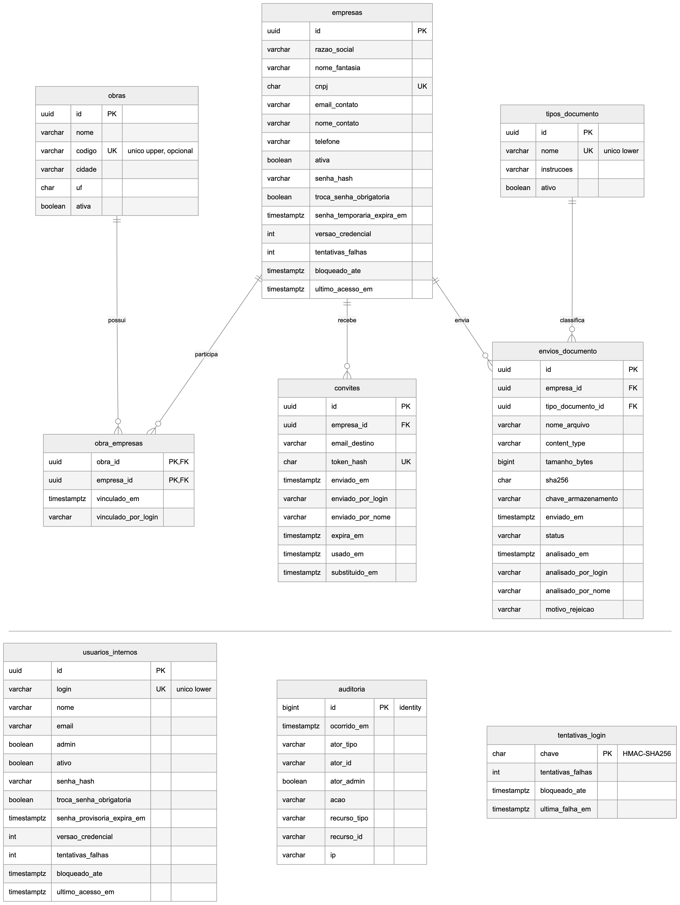

<!-- ANCORA: 3.1 -->



| Tabela | Chave e relacionamentos |
|---|---|
| obras | PK id |
| empresas | PK id; CNPJ único |
| obra_empresas | PK (obra_id, empresa_id); FKs para obras e empresas |
| tipos_documento | PK id; nome único |
| convites | PK id; FK empresa_id |
| envios_documento | PK id; FKs empresa_id e tipo_documento_id |
| usuarios_internos | PK id; login único |
| auditoria e tentativas_login | PK id; registro de ações e de tentativas de acesso |

Nenhuma estrutura é ligada a IA na versão atual.

<!-- ANCORA: 3.2 -->

| Método | Endpoint | Função |
|---|---|---|
| POST | /api/portal/auth/login | Login da terceirizada (CNPJ e senha) |
| GET | /api/portal/documentos | Documentos exigidos e situação |
| POST | /api/portal/documentos/{id}/envios | Envio de arquivo |
| POST | /api/fluig/auth/login | Login da área Jotanunes |
| GET/POST | /api/fluig/obras, /empresas, /tipos-documento | Consulta e cadastro |
| POST | /api/fluig/empresas/{id}/convites | Envio do convite |
| POST | /api/fluig/envios/{id}/aprovar e /rejeitar | Análise do documento |

Requisições e respostas em JSON (envio de arquivo em multipart). Erros seguem um formato único:

```json
{ "status": 400, "code": "VALIDACAO", "title": "Confira os dados informados." }
```

<!-- ANCORA: 3.3 -->

A terceirizada envia o arquivo pelo portal; a API valida formato e tamanho, grava o arquivo e o registro no PostgreSQL e devolve a situação "Em análise". O analista aprova ou rejeita na área Jotanunes; em caso de rejeição, a empresa recebe e-mail com o motivo e vê a nova situação no portal. Não há integração com IA na versão atual.

<!-- ANCORA: 3.4 -->

| Falha | Tratamento |
|---|---|
| Dado inválido ou ausente | 400 com o campo e a mensagem |
| Arquivo de tipo errado / grande demais | 415 / 413 |
| Sem permissão ou sessão expirada | 403 / 401 |
| Muitas tentativas | 429 (limite por IP) e bloqueio temporário do login |
| Falha no serviço de e-mail | Convite não é registrado e o erro é exibido |

<!-- ANCORA: 4.1 -->

| Camada | Tecnologia |
|---|---|
| Backend | .NET 8 (ASP.NET Core), arquitetura hexagonal, EF Core |
| Banco | PostgreSQL 16 |
| Frontends | React + Vite + TypeScript, CSS puro |
| E-mail | Resend |
| Infraestrutura | VPS Ubuntu, nginx, HTTPS (Let's Encrypt) |

Ferramentas de IA: Claude Code (pago); GitHub Spec Kit, faster-whisper e Playwright (gratuitos).

<!-- ANCORA: 4.2 -->

```text
backend/    API em camadas (Domain, Application, Infrastructure, Api) e testes
fluig-app/  área Jotanunes
portal/     portal da terceirizada
specs/      especificação, contrato da API e tarefas
deploy/     scripts de publicação
```

Os frontends não chamam serviços de IA. Erros, lentidão e indisponibilidade aparecem na tela com mensagem e opção "Tentar de novo"; no servidor, a API reinicia sozinha em caso de queda.
